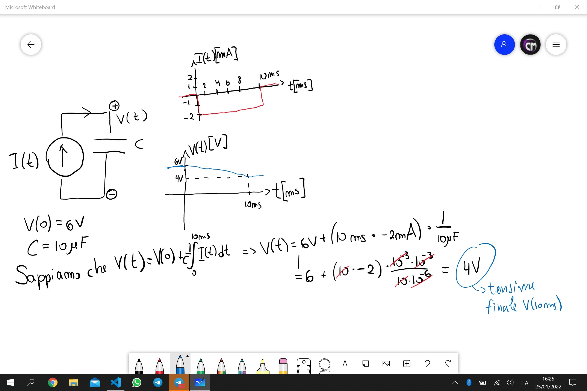
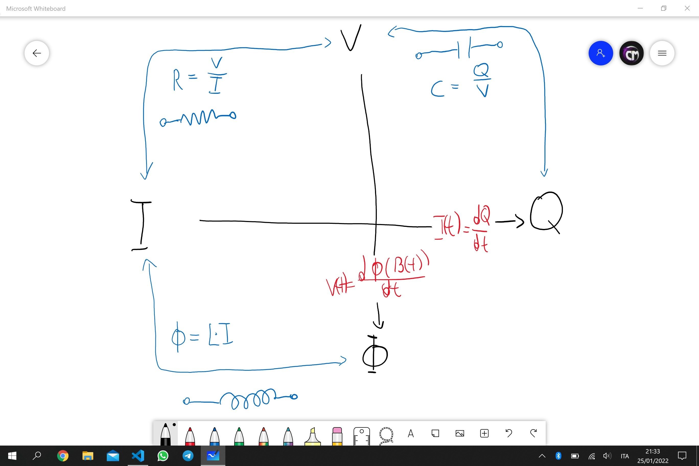
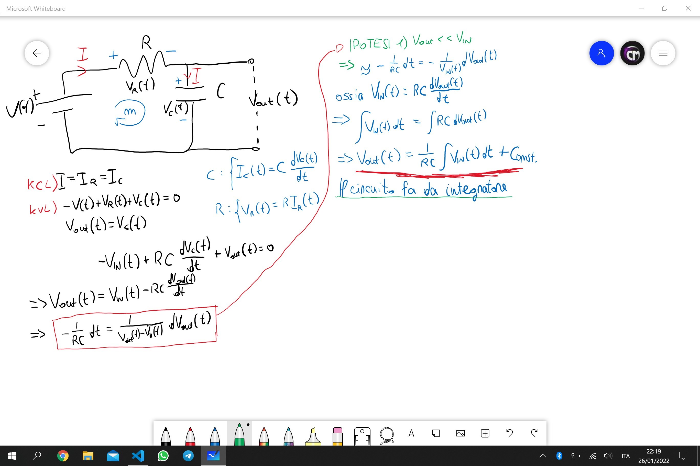
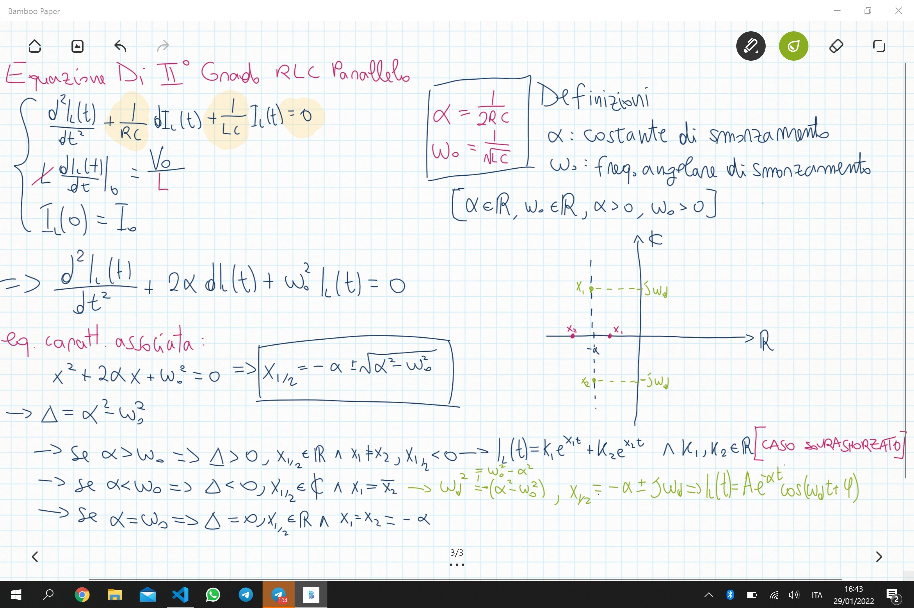
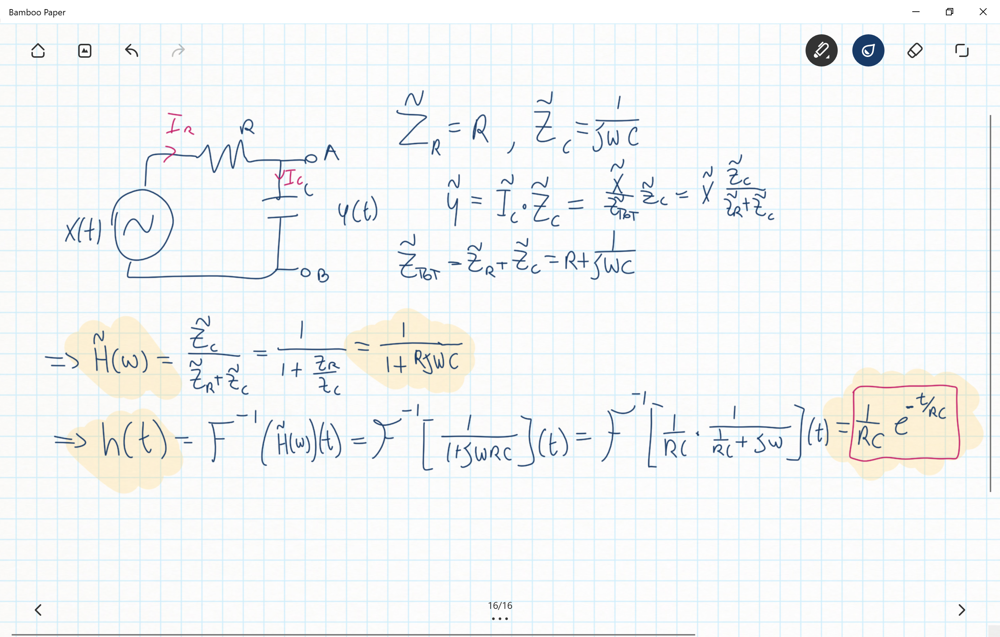
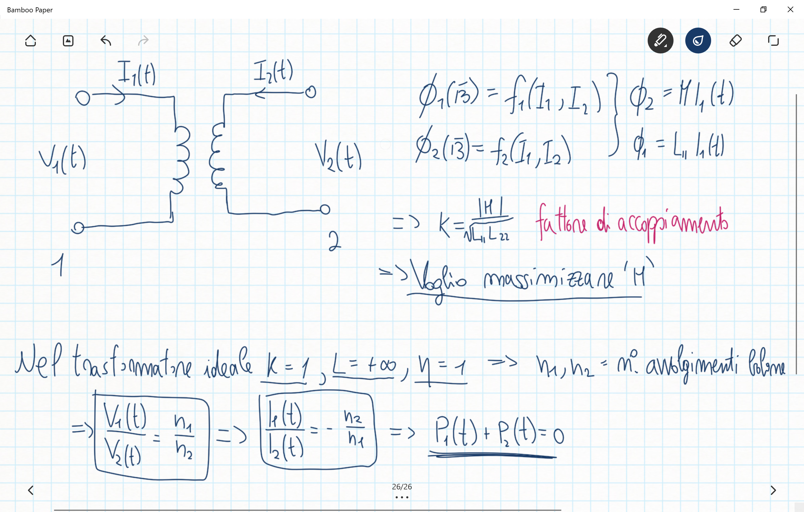

Fisica 2 - Lezione 1
====================

Obbiettivo:
-----------
    Circuito Reale -> Modello -> Previsione/Comprensione

---
Modelli:
--------
- A Parametri **Concentrati**
- A Parametri **Distribuiti**

Il Modello **A Parametri Concentrati** saranno la branca di modelli trattati in questo corso.  
In questi modelli possiamo trattare gli elementi in maniera isolata, senza valutare possibili interferenze interne al circuito stesso.  
Ciò avviene quando la dimensione delle componenti del circuito sono molto minori della lunghezza d'onda minima prodotta dal circuito ($\lambda \gg d$).

Nel caso di segnali audio:
    $$f_{max} = \frac{c}{\lambda_{min}} \land f_{max} = 20kHz <=> \lambda_{min} = \frac{c}{f_{max}} => \lambda_{min} \approx 15km$$

---
Elementi Circuitali:
--------------------
Tratteremo principalmente elementi circuitali a 2 morsetti.  
Dovremo prima di tutto, per studiare il circuito, definire un verso della corrente, si tratta di un riferimento puramente arbitrario.  
$$V(t) = \Delta V(t) = V_{A}(t) - V_{B}(t), se V_{A}(t) > V_{B}(t) => V(t) > 0$$  
$V(t)$ è detta quindi tensione di lato ed $I(t)$ è la corrente di lato.  

---
Leggi Di Kirchoff:
------------------
- KCL: Per ogni circuito a parametri concentrati, per ogni tempo, per ogni nodo, la somma algebrica di tutte le correnti di lato che entrano e lasciano il nodo è uguale a 0.
- KVL: Per ogni circuito a parametri concentrati, per ogni tempo, per ogni maglia, la somma algebrica di tutte le tensioni di lato che entrano ed escono dalla maglia sono uguali a 0.

---
Elementi Circuitali:
--------------------
- R: Resistenza o Resistore:  
    Qualsiasi elemento a 2 morsetti che in qualsiasi istante soddisfa la seguente relazione tra tensione e corrente di lato: $V(t) = I(t)R.$  
    Ne esistono di vari tipi:
    - Lineare / Non lineare:  
        Segue l'equazione lineare di Kirchoff: $V(t) = I(t)R.$  
        Anche detti resistori ohmici.  
    - Tempo Variante / Tempo Invariante:  
        Soddisfa la proprietà di tempo invarianza, ossia soddisfa la seguente relazione: $R(t) = R \space \forall t.$  

---
Fisica 2 - Lezione 2
====================

Resistenze:
-----------

Si possono distinguere in due categorie:  

E anche questi due tipi di resistenze possono essere tempo varianti o tempo invarianti.  

Una resistenza può essere per esempio un filo metallico, e la sua resistenza sarà funzione della lunghezza, della sezione e del materiale. $$R = \rho \cdot \frac{l}{s}$$ Ove vige la relazione $$\rho(T) = \rho(0)(1 + \alpha T)$$ per cui $\alpha$ dipende dal materiale.  
Nella costruzione di resistenze si punta a minimizzare il più possibile $\alpha$, in modo che la resistenza non vari molto in funzione della temperatura.  

Sapendo che $J = \frac{I}{S}$ e che $V(t)=RI(t)$ si può riscrivere la legge di Ohm come:  
$$\rho \cdot \frac{l}{s} \cdot JS = E \cdot l \longrightarrow E = \rho J $$  

---
Resistori Notabili:
-------------------

- I resistori LTI seguono l'equazione:  
$$V(t) = R(t) \cdot I(t) \space | \space R = const \space \forall t.$$  
- Resistore con $R=+\infty$: è un circuito aperto.
- Resistore con $R=0$: è un corto circuito.
- I resistori Lineari Tempo Varianti, detti anche 'trimmer'.  
Esempio:  
$$R(t) = R_{1} + R_{2}cos(2\pi f_{1}t)$$  
$$I(t) = I_{0}cos(2\pi f_{2}t)$$  
$$V(t) = I_{0}R_{1}cos(2\pi f_{2}t) + \frac{R_{2}I_{0}}{2}cos(2\pi(f_{1}+f{2})t) + \frac{R_{2}I_{0}}{2}cos(2\pi(f_{1}-f_{2})t)$$  

---
I Generatori:
-------------

- Generatori Di Tensione:  
Un generatore di tensione è un elemento circuitale a due terminali che mantiene una certa tensione ai capi dei terminali per ogni corrente $I(t)$ che fluisce attraverso di esso.  
La batteria è un esempio di generatore di tensione.  
Spegnere un generatore di tensione equivale ad un cortocircuito.  
- Generatori Di Corrente:
Un generatore di corrente è un elemento circuitale a due terminali che mantiene una certa corrente ai capi dei terminali per ogni tensione $V(t)$ che fluisce attraverso di esso.
Spegnere un generatore di corrente equivale ad un circuito aperto.  

Un generatore non ideale di tensione:

  

Segue l'equazione: $V_{L} = V_{OC} - R_{S}I_{L}$  
Ossia la tensione erogata dipende dalla corrente erogata e dalla resistenza interna, e quindi dalla qualità costruttiva.  
Ciò implica che possiamo modellare un generatore reale come un generatore reale con una resistenza parasidica in serie.

---
Il Teorema Di Thevenin:
-----------------------

Qualsiasi circuito a due terminali contenente dei generatori indipendenti complesso a piacere è sempre riportabile ad un circuito equivalente composto da un generatore di tensione in serie ad un resistore.  

  

---
Il Teorema Di Norton:
---------------------

Qualsiasi circuito a due terminali costituito da elementi lineari e generatori indipendenti complesso a piacere è equivalente ad una sorgente di corrente con un resistore in parallelo.  

  

Si noti la similarità tra i due teoremi.  
Esempio di applicazione di entrambi:  

  

La potenza di un circuito si definisce come: $P_{L} = V_{L} \cdot I_{L}$  
Se $R_{L} = 0 \Longrightarrow V_{L} = 0V, I_{L} = \frac{V}{R_{S}} \Longrightarrow P_{L} = 0W$  
Se $R_{L} = \infty \Longrightarrow V_{L} = V, I_{L} = 0A \Longrightarrow P_{L} = 0W$  

Per un circuito generico contenente un generatore di tensione ideale con resistenza parasidica in serie, ed una resistenza di carico sappiamo che:  
$$P_{L} = V_{L}I_{L} = R_{L}I_{L}^2 = \frac{V_{L}^2}{R_{L}}$$  
$$V_{L} = \frac{VR_{L}}{R_{S}+R_{L}} \cdot \frac{V}{R_{S}+R_{L}} = \frac{V^2R_{L}}{(R_{S}+R_{L})^2} = \frac{V^2}{(\frac{R_{S}^2}{R_{L}}+R_{L}+2R_{S})}$$  
Volendo massimizzare la potenza deriviamo per $R_{L}$:  
$$\frac{d}{dR_{L}}(\frac{R_{S}^2}{R_{L}}+R_{L}+2R_{S}) = -\frac{R_{S}^2}{R_{L}^2}+1 = 0$$  
Ciò implica che: $R_{S} = \sqrt{R_{L}^2} = R_{L}.$
Ossia, per ottenere la potenza massima possibile, il nostro circuito dovrà avere una resistenza di carico $R_{L}$ uguale alla resistenza parasidica del generatore $R_{S}$.  

---
Fisica 2 - Lezione 3
====================

Condensatori:
-------------

Possono essere sia lineari che non. In ogni caso si tratta di componenti elettriche che mettono in relazione tensione e carica.

  

Noi studieremo i condensatori lineari, ossia quelli che soddisfano la relazione: $Q(t) = C(t)V(t) : C(t) = const \space \forall t.$  

---
I Condensatori LTI:
-------------------

Seguono l'equazione fondamentale: $Q(t) = C\cdot V(t).$  
Noi sappiamo che: $I(t) = \frac{d}{dt}Q(t) = \frac{d}{dt}(C\cdot V(t)) = C\cdot\frac{dV(t)}{dt}$  
Da ciò possiamo ricavare un'equazione in cui esplicitiamo la tensione:  
$$\int_{0}^t{I(\tau)d\tau} = \int_{0}^t{C\frac{d}{dt}V(t)dt} = \int_{V(0)}^{V(t)}{C\cdot dV(\tau)}$$  
Da cui ricaviamo che: $V(t)-V(0) = \frac{1}{C}\int_{a}^b{I(\tau)d\tau}$  
Queste saranno le equazioni fondamentali dei condensatori lineari:  
$$I(t) = C\cdot\frac{d}{dt}V(t)$$  
$$\Delta V = \int_{a}^{b}{I(\tau)d\tau}$$  
Quest'ultima equazione è spesso scritta nella forma:  
$$V(t) = V(0) + \int_{0}^{t}{I(\tau)d\tau}$$  
Questa equazione in particolare ha delle implicazioni importanti, ci dice che la tensione ad un dato istante dipende dal passato del condensatore. Si può quindi modellare un condensatore carico a $V(0) = V_{0}$ come un circuito composto dallo stesso condensatore scarico in serie ad un generatore di tensione con tensione nominale $V_0$.  

  

Un esempio di utilizzo di queste formule:  

  

Inoltre ricordiamo che la tensione di un condensatore è una quantità continua, a prescindere dal comportamento della corrente.  
Fisicamente parlando un condensatore è formato da due piastre metalliche parallele, la capacità è funzione della geometria: $C = \frac{\epsilon_{0}\cdot S}{d}$  

---
Induttori:
----------

E' un componente a due terminali che per ogni tempo 't' è caratterizzato dall'imporre una relazione ben definita tra il flusso del campo magnetico e la corrente che lo attraversa: $\Phi(B(t)) = f(I(t))$.  
In particolare noi studieremo gli induttori lineari tempo invarianti per cui vige la relazione: $\Phi(B(t)) = L(t)I(t) : L(t) = L = const \space \forall t$.  
Questa relazione di per se però non ci aiuta molto nella risoluzione di un circuito. Però noi sappiamo grazie alla legge di faraday che:  
$$\Delta V(t) = \frac{d\Phi(B(t))}{dt} = \frac{d}{dt}(L\cdot I(t))$$  
Da cui ricaviamo la relazione:  
$$\Delta V(t) = L\cdot\frac{dI(t)}{dt}$$  
Che ci dice che la tensione di un induttore è funzione della variazione della corrente che lo attraversa.  
Potrebbe tornare utile avere una relazione che esplica la corrente in funzione del tempo:  
$$I(t)-I(0)=\frac{1}{L}\int_{0}^{t}V(\tau)d\tau$$  
Scritto spesso come:  
$$I(t) = I(0) + \frac{1}{L}\int_{0}^{t}V(\tau)d\tau$$  
Equazione molto importante che ci dice che la corrente sarà sempre continua, a prescindere dalla forma d'onda della tensione.  
Fisicamente parlando, un induttore è un pacco di spire, detto anche solenoide, e l'induttanza è funzione della geometria:  
$$B_{0} = \mu_{0}\frac{N}{l}I$$  
$$\Phi(B_{0}) = NSB_{0}$$  
Da cui ricaviamo che:  
$$L = \mu_{0}\pi R^2\cdot\frac{N^2}{l}$$  

---
Fisica 2 - Lezione 4
====================

Il Solenoide:
-------------

Per ricavare il coefficiente di autoinduzione $L$ di un solenoide, immaginiamo di averne uno infinito.  
Definiamo la densità di spire come $n = \frac{N}{l}$.  
Noi sappiamo che gli induttori seguono la legge: $\Phi(B(t)) = L\cdot I(t)$.  
Preso un cammino chiuso perpendicolare alle spire otteniamo che $B_{0} = \mu_{0}\frac{N}{l}I\space$, e $\Phi(B_{0}) = B_{0}NS = \mu_{0}\frac{N}{l}INS$.  
Per cui otteniamo: $L = \mu_{0}\frac{N^2}{l}\pi R^2 = \mu_{0}n^2l\pi R^2$.  

---
Potenza Ed Energia:
-------------------

Dato un circuito composto da un generatore ed un bipolo, ossia un componente di un circuito formato da un ingresso e da un'uscita, la corrente entrante dovrà per forza essere uguale alla corrente uscente, e ai capi di questi poli ci sarà una certa differenza di potenziale, la potenza si può calcolare come $P(t) = V(t)I(t)$.  
Mentre l'energia si può calcolare come $E(t_{1}, t_{2}) = \int_{t_{1}}^{t_{2}}P(\tau)d\tau$.  

  

Preso un **resistore** generico, non necessariamente lineare, se i punti della retta sul grafico di tensione e corrente sono sul primo e terzo quadrante, il resistore ad ogni istante avrà una potenza positiva,e quindi si chiama componente passivo, in quanto dissipa energia.  

  

Preso un **condensatore** generico, l'energia necessaria a caricarlo sarà data dalla stessa formula: $E(t_{1}, t_{2}) = \int_{t_{1}}^{t_{2}}V(\tau)I(\tau)d\tau=\int_{t_{1}}^{t_{2}}V(\tau)\frac{dQ(\tau)}{d\tau}d\tau$  
Ciò si può riscrivere come:  
$$E(t_{1}, t_{2}) = \int_{Q(t_{1})}^{Q(t_{2})}V(Q)dQ = \int_{Q(t_{1})}^{Q(t_{2})}\frac{Q(t)}{C}dQ=\frac{1}{2C}Q^2$$  
Posto che $Q(t_{1}) = 0 \space \land Q(t_{2}) = Q$.  

  

Preso un **induttore** generico, l'energia necessaria a caricarne il campo magnetico si può definire come:  
$$E(t_{1}, t_{2}) = \int_{t_{1}}^{t_{2}}V(\tau)I(\tau)d\tau=\int_{t_{1}}^{t_{2}}\frac{d\Phi(B(t))}{dt}\cdot \frac{\Phi(B(t))}{L}dt$$
Ciò si può riscrivere come:  
$$\int_{\Phi(B(t_{1}))}^{\Phi(B(t_{2}))}\frac{\Phi(B(t))}{L}d\Phi(B(t)) = \frac{\Phi(B(t))^2}{2L}=\frac{LI^2(t)}{2}$$  

---
Diagramma Riassuntivo:
----------------------

Riporto qui sotto un diagramma riassuntivo di tutte le componenti studiate nelle ultime lezioni, e tutte le relazioni più importanti che comportano.  

  

---
Reti di Resistori:
------------------

Nel caso di resistenze in serie, si può dimostrare che $R_{eq} = \Sigma_{i=1}^{n}R_i$.  

  

Nel caso di generatori in serie, se sono di tensione si possono banalmente sommare le tensioni, mentre nel caso di generatori di corrente bisogna far attenzione che KCL deve valere!  

  

Nel caso di resistori in parallelo invece, si può dimostrare che $\frac{1}{R_{eq}} = \frac{1}{\Sigma_{i=1}^{n}R_i}$.  

  

Nel caso di condensatori in serie, si può dimostrare che $\frac{1}{C_{eq}} = \Sigma_{i=1}^{n}\frac{1}{C_i}$.  

  

Nel caso di condensatori in parallelo invece, si può dimostrare che $C_{eq} = \Sigma_{i=1}^{n}C_i$.  

  

Nel caso di induttori in serie, si può dimostrare che $L_{eq} = \Sigma_{i=1}^{n}L_i$.  

  

Nel caso di induttori in parallelo, si può dimostrare che $L_{eq} = \frac{1}{\Sigma_{i=1}^{n}\frac{1}{L_i}}$.

  

Quindi possiamo riassumere in un diagramma riassuntivo tutto ciò:

  

---
Fisica 2 - Lezione 5
====================

Principio Della Sovrapposizione:
--------------------------------

Si definisce un circuito lineare, un circuito formato da elementi passivi lineari accoppiati da generatori indipendenti.  
Si definisce un circuito tempo invariante se gli elementi passivi sono tempo invarianti, i generatori basta che siano indipendenti.  
Il principio della sovrapposizione ci dice che in un circuito lineare, contenente più generatori indipendenti, la corrente/tensione di lato di una componente è equivalente alla somma algebrica delle correnti/tensioni di lato di tali componenti in tutti i circuiti composti dalla stessa rete ed un solo generatore acceso alla volta.

Esempio:

  

Torna comodo in certe situazione per evitare di scomodare le leggi di kirchhoff dei nodi e delle maglie.  

---
Lo switch:
----------

All'interno di un circuito si può trovare una componente che fa da selettore all'interno del circuito, e quindi a seconda della sua posizione conclude un circuito a se stante.

Esempio:

  

---
Risposta Ad Ingresso Zero:
--------------------------

Proviamo ora a descrivere la carica del condensatore, da scarico, allo stesso modo in cui abbiamo calcolato la sua scarica nell'esempio precedente.  

  

Se risolvo il circuito soggetto ad un ingresso nel momento in cui non c'è energia immagazzinata in alcuna componente(capacitiva/induttiva) allora tale risposta è detta risposta a stato zero.  

Quindi nel caso di un circuito RC, sappiamo che:
- La risposta con ingresso zero è: $V_{C}(t) = V_{0}\cdot e^{-\frac{t}{RC}}$  
- La risposta a stato zero è: $V_{C}(t) = V_{0}(1-e^{-\frac{t}{RC}})$  

Studiamo quindi un RC più complesso, dove ci avvaliamo di Thevenin e poi proviamo a risolvere le equazioni per la carica di un condensatore parzialmente carico a $t = t_{0}$.  

  

---
Fisica 2 - Lezione 6
====================

Il circuito RC:
---------------

Riprendendo da dove ci siamo lasciati nella lezione precedente, avevamo calcolato analiticamente applicando le leggi di kirchoff la risposta generale di un circuito RC, ad un segnale, con condensatore parzialmente carico.

  

Notiamo che questa equazione:  
$$V_{C}(t) = V_{0}e^{-\frac{t}{R_{eq}C}}+V_{eq}(1-e^{-\frac{t}{R_{eq}C}})$$  
**E' la somma algebrica di risposta a stato zero e risposta ad ingresso zero**, infatti:
- Risposta Ad Ingresso Zero: $V_{0}\cdot e^{-\frac{t}{R_{eq}C}}$  
- Risposta A Stato Zero: $V_{eq}(1-e^{-\frac{t}{R_{eq}C}})$  

Questa proprietà si preserva nei circuiti lineari.
La risposta generale di un circuito è data dalla somma della risposta a stato zero e la risposta ad ingresso zero.  

Proviamo quindi a dimostrarlo, partendo dall'equazione differenziale:  
$$\frac{d}{dt}V_{C}(t)+\frac{1}{R_{eq}C}V_{C}(t)=\frac{1}{R_{eq}C}V_{eq}$$  
Dividiamo quindi il problema nei due casi:  
- Il caso della **risposta ad ingresso zero**:  
E quindi otteniamo l'equazione omogenea associata:  
$$\frac{d}{dt}V_{C}^{O}(t)+\frac{1}{R_{eq}C}V_{C}^{O}(t)=0$$  
- Il caso della **risposta a stato zero**:  
Da cui otteniamo l'equazione non omogenea:  
$$\frac{d}{dt}V_{C}^{NO}(t)+\frac{1}{R_{eq}C}V_{C}^{NO}(t)=\frac{1}{R_{eq}C}V_{eq}$$  
Ricordiamoci inoltre che dividendo il problema in due, nel caso della risposta ad ingresso zero dobbiamo ricordare che $V_{C}^{O}(0) = V_{0}$, mentre nel caso della risposta a stato zero $V_{C}^{NO}(0) = 0$.  

A questo punto sommiamo le due equazioni e otteniamo:  
$$\frac{d}{dt}(V_{C}^{O}(t)+V_{C}^{NO}(t))+\frac{1}{R_{eq}C}(V_{C}^{O}(t)+V_{C}^{NO}(t))=\frac{1}{R_{eq}C}V_{eq}$$  
E ricordiamo anche di sommare le condizioni iniziali, quindi: $V_{C}(0)=V_{0}+0$.  
Da qua è facile notare che, essendo questa e l'equazione differenziale iniziale perfettamente equivalenti, ed essendo entrambi problemi di Cauchy, ossia problemi ad una sola soluzione, con le stesse condizioni di bordo, deve per forza valere la relazione: $V_{C}(t) = V_{C}^{O}(t)+V_{C}^{NO}(t)$.  
In altre parole, **la risposta generale di un circuito RC è data dalla somma della risposta ad ingresso zero e la risposta a stato zero**.  
Si può inoltre dimostrare che l'equazione differenziale iniziale è una funzione lineare, quindi: $f(\alpha x(t)+\beta y(t))=\alpha f(x(t))+\beta f(y(t))$, ed in particolare si può dimostrare che la risposta a stato zero è una funzione lineare.

---
Il Principio Di Sovrapposizione:
--------------------------------

Possiamo quindi affermare, avendolo dimostrato formalmente, ciò che ci dice il Principio Di Sovrapposizione:  
**La risposta di una rete lineare con stato zero dovuta a tutti i generatori indipendenti è equivalente alla somma delle risposte a stato zero dovute ai singoli generatori indipendenti.**  

---
I filtri RC:
------------

Ridisegniamo il circuito RC ponendo due capi alle estremità del condensatore, come se fosse un bipolo.  
Notiamo che, risolvendo l'equazione differenziale, sotto la supposizione che $V_{IN}\gg V_{OUT}$, il circuito RC si comporta da integratore, ossia $V_{OUT}$ è determinato dall'integrale di $V_{IN}$ a meno di una costante $\frac{1}{RC}$.  

  

Notiamo un comportamento del circuito, sotto queste condizioni, di tipo integrativo, ossia $V_{OUT}$ amplifica le lente fluttuazioni di tensione e riduce le veloci fluttuazioni di tensione di $V_{IN}$.  

Ridisegnando lo stesso circuito, ma questa volta scambiando resistenza e condensatore otteniamo:  

  

Notiamo un comportamento diverso del circuito, sotto queste nuove condizioni. Ossia si comporta da derivatore, amplificando le veloci fluttuazioni di tensione e riducendo le lente fluttuazioni di tensione di $V_{IN}$.  

Da ciò ricaviamo uno dei motivi più comuni per cui si incontrano gli RC all'interno dei circuiti elettrici:  
- Svolgono il lavoro di un filtro, una resistenza ed una resistenza in serie fanno si che il secondo capo del condensatore avrà una tensione che è equivalente a quella di ingresso a meno della componente continua, e quindi svolge il lavoro di tagliare la componente continua della forma d'onda, anche detto *coupling AC*.  
- Se incontrati come nei circuiti negli esempi prima citati svolgono il lavoro rispettivamente di filtri passa-basso(integrativo) e passa-alto(derivativo).  

---
Il circuito RL:
---------------

Proviamo ora a scambiare il condensatore con un induttore.

  

Notiamo che la corrente che scorre nell'induttore istantaneamente sarà nulla e col passare del tempo incrementerà con un andamento identico alla tensione nel caso della carica di un condensatore, a meno di costanti moltiplicative e di tempo.  
Anche in questo caso possiamo definire una costante di tempo $\tau = \frac{L}{R}$.  

Ora studiamo il comportamento del circuito RL in scarica, quando il campo magnetico dell'induttore è carico, ossia la corrente che scorre per l'induttore è massima, e viene chiuso il circuito staccando la batteria.  

  

Notiamo che l'equazione che determina l'andamento della corrente attraverso l'induttore è la stessa che determina l'andamento della tensione attraverso il condensatore, a meno di costanti moltiplicative e di tempo.  
Ricordiamo inoltre che $V_{L}=-V_{R}=-V_{IN}\cdot e^{-\frac{R}{L}t}$, ossia **la tensione attraverso l'induttore è in opposizione a quella attraverso il resistore, in quanto egli si oppone alla variazione di corrente!**  

---
Fisica 2 - Lezione 7
====================

Il circuito RL:
---------------

Studieremo ora il circuito RL della lezione precedente, utilizzando la funzione di Heaviside, o funzione gradino, per indicare lo spostamento dello switch dalla posizione B alla posizione A e viceversa.  

  

Questo è un buon modo per formalizzare il funzionamento di un interruttore all'interno di un circuito.  
Possiamo quindi esplicitare una formula che determini la tensione attraverso un condensatore in un RC, sia esso parallelo o in serie che soddisfi $\forall t \in \R$, sfruttando la funzione di Heaviside.  

  

---
L'Operatore Risposta Stato Zero:
--------------------------------

Definiamo quindi l'operatore **Risposta A Stato Zero**:  
$$V(t) = \mathscr{Z_{0}}(I_{S}(t))$$  
Riscriviamo il problema di cauchy dell'ultimo circuito RC trattato:  
$$C\frac{dV(t)}{dt}-\frac{V(t)}{R}=I_{S}(t) \land V(0) = 0$$  
E ricordiamoci che la forma d'onda della corrente era:  
$$I_{S}(t) = I_{0}\cdot H(t)$$  
Cosa succede allora se decido di traslare l'ingresso:  
$$I_{\Delta t}(t+\Delta t) = I_{S}(t)$$  
Che è la stessa cosa di dire:  
$$I_{\Delta t}(t) = I_{S}(t-\Delta t)$$  
Quindi $I_{\Delta t}(t)$ è solo il traslato a destra del gradino.  
Se volessi scoprire il $V(t)$ causato da questa nuova corrente, devo per forza rivalutare l'intera equazione differenziale o esiste una via più semplice?  
Ipotizziamo che la traslazione degli argomenti delle funzioni dipendenti dal tempo nel problema di cauchy possa esser soluzione:  
$$C\frac{dV(t-\Delta t)}{dt}-\frac{V(t-\Delta t)}{R}=I_{S}(t-\Delta t) \land t \ge \Delta t$$  
Definiamo ora : $y(t) = V(t-\Delta t)$ ove $V(t-\Delta t)$ è la soluzione del problema di cauchy originale, traslata.  
Allora $y(\Delta t) = V(\Delta t - \Delta t) = V(0)$.  
E' evidente quindi che il problema di cauchy:  
$$C\frac{dy(t)}{dt}-\frac{y(t)}{R}=I_{\Delta t}(t) \space \land y(\Delta t) = 0$$  
E' lo stesso problema di cauchy iniziale, ma con la condizione di bordo traslata.  
Ciò implica la **tempo invarianza** dell'operatore risposta a stato zero.  
Inoltre è di facile dimostrazione che l'operatore a stato zero **è lineare**.  

---
L'Operatore Traslazione Temporale:
----------------------------------

Viene definito come: $\mathscr{T_{\Delta t}}\space$ l'**operatore traslazione temporale**, che prende come argomento una funzione e la trasla di un $\Delta t$.  
Quindi:  
$$\mathscr{T_{\Delta t}}(f(t)) = f(t-\Delta t)$$  
Questo oggetto gode di due proprietà:
- Additività: $\mathscr{T_{\Delta t}}(f(t)+g(t)) = \mathscr{T_{\Delta t}}(f(t)) + \mathscr{T_{\Delta t}}(g(t))$  
- Omogeneità: $\mathscr{T_{\Delta t}}(Af(t)) = A\mathscr{T_{\Delta t}}(f(t))$  

Quindi l'operatore traslazione temporale **è lineare**.  

Un'ulteriore proprietà molto importante è che l'operatore traslazione temporale e l'operatore risposta a stato zero **commutano**:  
$$\mathscr{T_{\Delta t}}(\mathscr{Z_{0}}(I(t)))=\mathscr{Z_{0}}(\mathscr{T_{\Delta t}}(I(t)))=\mathscr{Z_{0}}(I(t-\Delta t))$$  
Questa proprietà è valida $\forall I(t), \forall t, \forall \Delta t:\Delta t \ge 0$.  

---
La Delta Di Dirac:
------------------

Definiamo ora la Delta Di Dirac, una distribuzione $\delta(t)$ che soddisfa la proprietà:  
$$\int_{-\infty}^{+\infty}\delta(t)f(t)dt=f(0), \forall f(t)$$  
Inoltre, se $f(t) = 1 \Longrightarrow A_{\delta(t)}=1$, notiamo che l'area sottesa dalla delta è uguale a 1, nonostante sia un impulso infinitamente stretto.  
La risposta a stato zero alla delta di Dirac prende il nome di **Risposta All'Impulso**: $h(t)$, mentre la risposta a stato zero al gradino unitario prende il nome di **Risposta Al Gradino Unitario** e viene spesso rappresentata con $g(t)$.  
Definiamo allora una funzione che approssimi la delta di Dirac:  
$$P_{d}(t):=0\space se\space t<0$$  
$$P_{d}(t):=\frac{1}{d}\space se\space 0\le t\le d$$  
$$P_{d}(t):=0\space se\space t>d$$  
Notare che soddisfa la proprietà di avere un'area pari a 1.  
Sappiamo inoltre che $\lim_{d \to 0}P_{d}(t)=\delta(t)$.  
Proviamo quindi a vedere cosa succede se applichiamo un simile segnale all'ingresso di un RC e lo mandiamo al limite per $d \to 0$.  

  

Come possiamo vedere, al limite $d \to 0$ la nostra risposta impulsiva tende a $h(t)=\frac{1}{C}e^{-\frac{t}{RC}}$  
Inoltre nel periodo infinitesimale di impulso $0 < t < d$ sappiamo che la tensione nel condensatore sale in maniera lineare, infatti:  
$$\lim_{d \to 0}\frac{R}{d}(1-e^{-\frac{t}{RC}})=\frac{R}{d}(1-1+\frac{t}{RC})=\frac{t}{dC}$$  
E la pendenza della retta che formerà la tensione in quell'istante sarà:  
$$\frac{d}{dt}\frac{t}{dC}=\frac{1}{dC}$$  
Da cui possiamo notare che questa pendenza dipende fondamentalmente da due cose, dal quanto è stretto, istantaneo, l'impulso, e da quanta carica è in grado di immagazzinare il condensatore.  
Per evitare di dover sempre specificare $t\ge0$ possiamo riscrivere l'equazione finale come:  
$$h(t) = H(t)\cdot\frac{1}{C}e^{-\frac{t}{RC}}$$  
Nella prossima lezione verrà trattato come è dimostrabile che vale la proprietà:  
$$h(t) = \frac{d}{dt}g(t)$$  
Ossia la risposta all'impulso è equivalente alla derivata della risposta al gradino unitario.  

---
Fisica 2 - Lezione 8
====================

Le risposte al gradino ed all'impulso:
--------------------------------------

Nell'ultima lezione ci siamo lasciati dichiarando una proprietà importantissima dei circuiti lineari, ossia che la risposta impulsiva non è altro che la derivata della risposta al gradino:  
$$h(t) = \frac{d}{dt}g(t)$$  
Possiamo dimostrarlo prendendo in esame il circuito studiato l'ultima volta:  

  

Come possiamo vedere, sfruttando alcune proprietà degli operatori definiti a lezione, e ridefinendo $P_{d}(t)$ con l'utilizzo della funzione di Heaviside, riusciamo a dimostrare matematicamente che $h(t)$ è la derivata della risposta al gradino del circuito, per ogni circuito lineare.  

---
Esercizio Per Casa:
-------------------

Ci viene proposto di applicare questa proprietà su un circuito RL in serie, calcolando quindi entrambe le risposte e provando a verificare che la risposta all'impulso sia effettivamente pari alla derivata della risposta al gradino.  

  

Si può partire quindi da questa soluzione alla risposta al gradino, e calcolare la risposta all'impulso:  

$$g(t) = H(t)\frac{1}{R}(1-e^{-\frac{t}{\tau}})$$  
$$h(t) = \frac{d}{dt}(g(t))=H(t)\frac{e^{-\frac{t}{\tau}}}{L}$$  

$$g(t) = \int_{-\infty}^{+\infty}\frac{1}{L}H(t)e^{-\frac{t}{\tau}}dt=\int_{0}^{t}\frac{1}{L}e^{-\frac{t}{\tau}}dt=\frac{1}{R}(1-e^{-\frac{t}{\tau}})$$  

---
I Circuiti RLC:
---------------

Studiamo quindi ora la risposta ad ingresso zero, di un circuito RLC parallelo, con condensatore carico parzialmente.  

  

Arriviamo di fronte ad un problema di Cauchy composto da un'equazione differenziale di secondo ordine omogenea e due equazioni di contorno.  

  

Notiamo quindi che nello studiare l'equazione caratteristica associata all'equazione differenziale di secondo grado, abbiamo 3 possibili scenari:  
$\Delta > 0\space$ Detto **Caso Sovrasmorzato**  
$\Delta < 0\space$  
$\Delta = 0\space$  

---
Fisica 2 - Lezione 9
====================

Il Circuito RLC:
----------------

Riprendendo dall'ultima lezione, in cui abbiamo trovato l'equazione differenziale di secondo grado ed abbiamo iniziato ad analizzarla:  

  

Da questa analisi riusciamo a trovare vari possibili scenari.  
Il nostro segnale può smorzarsi molto rapidamente, può oscillare nello smorzarsi oppure può smorzarsi con una gobba, causata da quel termine lineare al tempo nel caso $\Delta=0$.  
Proviamo quindi a studiare il primo caso:  

  

Questa è la soluzione generale dell'equazione che descrive la corrente all'interno dell'induttore di un circuito RLC parallelo nello specifico caso sovrasmorzato.  
Studiamo ora anche il caso sottosmorzato nello specifico:  

  

Troviamo quindi un'equazione per determinare quale sarà la fase iniziale della corrente nel caso di un'oscillazione dovuta ad un circuito di tipo sottosmorzato.  

Definiamo ora una nuova costante del circuito RLC, detta **Fattore Di Qualità**, o $Q$, che è lo smorzamento relativo dell'oscillazione, definito come:  
$$Q = \frac{\omega_{0}}{2\alpha} = \frac{RC}{\sqrt{LC}} = R\sqrt{\frac{C}{L}}$$  
Questa equazione chiaramente vale per i circuiti RLC in parallelo, nel caso apportassimo modifiche alla topologia della rete, cambierebbe anche la formula di $Q$.  
$Q$ è un valore indicativo che ci dice quanta energia c'è nel sistema rispetto a quanta ne viene dissipata.  
$$Q\space\alpha\space\frac{E_{sistema}}{E_{dissipata}}$$  
Proviamo ora a misurare il $Q$ nelle varie casistiche dell'equazione differenziale:  
$$\Delta > 0 : \alpha > \omega_{0} \Longrightarrow Q < \frac{1}{2}$$  
$$\Delta < 0 : Q > \frac{1}{2}, se \space\alpha \to \infty \Longrightarrow Q \to \infty$$  
$$\Delta = 0 : x_{\frac{1}{2}}=-\alpha=-\omega_{0}\Longrightarrow Q = \frac{1}{2}$$  
$$\alpha \to 0 : Re(x_{\frac{1}{2}}) = 0, Im(x_{\frac{1}{2}}) \ne 0 \Longrightarrow Q \to \infty$$  

Ciò che abbiamo determinato fin'ora è stata la **risposta ad ingresso zero** del circuito RLC parallelo. Proviamo ora a studiarne invece la **risposta a stato zero**, ossia ciò che accade nel momento in cui il circuito da spento viene alimentato in qualche modo.  

  
  

Vediamo quindi che nel caso sottosmorzato la corrente oscilla attorno al valore di corrente in ingresso, facendo rimbalzare energia tra induttore e condensatore, seguendo l'andamento di un coseno sfasato di $\theta$, e nel tempo si stabilizza, a causa del dumping dovuto ad $e^{-\alpha t}$.  

Nel caso sovrasmorzato invece, la corrente ha un andamento diverso, infatti la corrente non presenta termini oscillatori, invece si nota una chiara resistenza all'ingresso causata dall'induttore che nel tempo si annulla grazie ai termini $e^{x_{\frac{1}{2}}t}$ ricordandoci che $x_{\frac{1}{2}} < 0$, stabilizzando la corrente attorno al valore della corrente in ingresso.  

---
Fisica 2 - Lezione 10
=====================

Il Circuito RLC:
----------------

Tornando a parlare di circuiti RLC ricordiamoci la soluzione al caso sovrasmorzato:  
$$I_L(t)=(\frac{1}{x_1-x_2}(x_2e^{x_1t}-x_1e^{x_2t}) + 1)H(t)
$$  
E la soluzione al caso sottosmorzato:  
$$I_L(t)=(-\frac{\omega_0}{\omega_d}e^{-\alpha t}\cos(\omega_d t-\phi)+1)H(t)$$  
Ed osserviamo il comportamento della corrente descritto da queste due equazioni in maniera grafica:  

  

Proviamo quindi a studiare il comportamento della tensione di lato partendo dalle equazioni della corrente che abbiamo ricavato.  

  

Notare come nel caso sottosmorzato la tensione di lato segue un'andamento sinusoidale, e cioè parte da 0.  
Ciò implica che nell'istante subito successivo all'accensione del generatore, nel resistore non scorrerà corrente, perchè deve seguire l'equazione $V_R = RI_R$, e quindi se $V_R = 0$ allora anche $I_R = 0$. E sicuramente non scorrerà corrente nell'induttore, in quanto si evince dall'equazione per la corrente dell'induttore, che parte anch'essa da 0, nell'istante 0. Quindi tutta la corrente nell'istante $t=0^+$ scorrerà all'interno del condensatore.  

Notiamo inotre che sempre nel caso sottosmorzato, se facciamo il limite per $t \to 0$ dell'equazione della tensione di lato del circuito, troviamo come si comporta la tensione in 0 e come varia la corrente in 0, in quanto vale sempre la relazione $I_C=\frac{d}{dt}V_C(t)$:  
$$\lim_{t\to 0}V(t)=\sqrt{\frac{L}{C}}\omega_{0}t$$  
Per tempi piccoli la tensione è proporzionale al tempo e la corrente ha una variazione direttamente proporzionale al tempo.  

Proviamo quindi a trovare la risposta all'impulso del circuito RLC partendo dalla risposta al gradino, ricordandoci sempre che vale la relazione $h(t) = \frac{d}{dt}g(t)$, per cui:  
$$h(t)=\frac{1}{L}\cdot\sqrt{\frac{L}{C}}\frac{\omega_0}{\omega_d}e^{-\alpha t}\sin(\omega_d t)H(t)=\frac{\omega_0^2}{\omega_d}e^{-\alpha t}\sin(\omega_d t)=I_L^\delta(t)$$  
$$V^\delta(t)=L\frac{dI_L^\delta(t)}{dt}=\sqrt{\frac{L}{C}}\frac{\omega_0^2}{\omega_d}e^{-\alpha t}\cos(\omega_d t + \phi)H(t)$$  
Da ciò scopriamo che la corrente nell'induttore, in risposta ad un impulso, sarà un'oscillazione centrata in $0$ che partità sempre da $0$ e col tempo si annullerà. Mentre la tensione di lato è più interessante, infatti sarà sempre un'oscillazione centrata in $0$ che col tempo viene dissipata ma questa volta non parte da $0$, anzi segue l'andamento del coseno ed inoltre ricompare il termine dello sfasamento di $\phi$ e quindi la tensione di lato iniziale sarà una funzione dei valori di R, L e C.  
Si può infatti ricavare che $cos(\omega_dt+\phi)=0$ quando $t=\frac{\frac{\pi}{2}-\phi}{\omega_d}$.  

Se proviamo a scrivere l'equazione differenziale dell'RLC in serie, notiamo che è molto simile all'equazione differenziale dell'RLC parallelo. Le due equazioni infatti, sono tanto simili da poter trovare un cambio di variabili che ci permetta istantaneamente di trovare le soluzioni del circuito in serie partendo dalla variante parallela.  
Quando ciò accade si dice che i due circuiti sono **duali** ossia conoscendo le soluzioni di un circuito posso trovare direttamente le soluzioni dell'altro valutando la corrispondenza tra le due equazioni.  

---
Le Tensioni Di Nodo:
--------------------

Possiamo definire dei nuovi riferimenti chiamati tensioni di nodo, che ci torneranno utili nella vita reale nella progettazione e lo studio di circuiti elettrici.  
Ci basterà sacrificare un nodo che faccia da riferimento, e poi potremo esprimere un valore di tensione ad ogni altro nodo della rete con riferimento a questo nodo.  

  

---
La Rete Schematizzata:
----------------------

Possiamo schematizzare una generica rete con un ingresso ed un'uscita come un blocco 'N', per cui graficamente: $x(t) \to N \to y(t)$.  
Allora sappiamo che varrà la relazione:  
$$\frac{d^ny(t)}{dt^n}+a_1\frac{d^{n-1}y(t)}{dt^{n-1}}+...+a_ny(t)=b_0\frac{d^mx(t)}{dt^m}+b_1\frac{d^{m-1}x(t)}{dt^{m-1}}+...+b_mx(t)$$  
Allora possiamo scrivere la soluzione dell'omogenea come:  
$$s^n+a_1s^{n-1}+...+a_ns=0$$  
E questa avrà soluzioni: $s_1, s_2, ..., s_n$.  
Allora possiamo scrivere che:  
$$y(t) = y^h(t) + y^P(t)$$
Dove la forma dell'omogenea sarà del tipo:  
$$y^h(t)=\sum_{i=1}^nk_ie^{s_it}$$  
Ove $s_1, s_2, ..., s_n$ distinte.  
Questo vale quindi per circuiti di qualsiasi ordine.  

---
L'Integrale Di Convoluzione:
----------------------------

Vogliamo ora capire come possiamo studiare il comportamento di un circuito LTI con un ingresso arbitrario.  
Dove l'ingresso dev'essere una funzione continua a tratti.  
E proviamo a fare ciò con una rete di cui conosciamo solo la risposta all'impulso.  

  

Scopriamo quindi che in un circuito LTI, la risposta ad un segnale generico non sarà altro che l'integrale di convoluzione e si può ricavare a partire dalla conoscenza della risposta impulsiva del circuito.  
Quindi preso un circuito sappiamo che se $x(t) \to N \to y(t)$ allora per definizione $\delta(t) \to N \to h(t)$. Ed inoltre, in quanto circuito LTI varrà anche $\delta(t-\tau) \to N \to h(t-\tau)$.  
Possiamo dire che varrà anche:  
$$x(t')\delta(t-t') \to N \to x(t')h(t-t')$$  
Ma allora sappiamo che:  
$$\int_{-\infty}^{+\infty}x(t')\delta(t-t')dt\to N \to\int_{-\infty}^{+\infty}x(t')h(t-t')dt$$  
Ma questo è equivalente a scrivere:  
$$x(t)\to N \to \int_{-\infty}^{+\infty}x(t')h(t-t')dt$$  
Ma allora:  
$$y(t) = \int_{-\infty}^{+\infty}x(t')h(t-t')dt=x(t)*y(t)$$  
Definiamo ora alcune proprietà dell'integrale di convoluzione:  
- E' lineare:  
$h(t)*(\alpha x_1(t)+\beta x_2(t))=\alpha h(t)*x_1(t)+\beta h(t)*x_2(t)$  
- E' causale:  
Se $x(t)=0\space\forall t<0 \Longrightarrow y(t)$ dipende da $x(t') : 0 \le t' < t$  
- E' un'invariante temporale:  
Posto che $y(t)=x(t)*h(t) \Longrightarrow y(t-\tau)=x(t-\tau)*h(t)$  
- Ha una forma equivalente:  
$y(t)=\int_{t_0}^tx(t')h(t-t')dt=\int_{0}^{t}x(t-t')h(t')dt'$  

---
Fisica 2 - Lezione 12
=====================

La Risposta Sinusoidale:  
------------------------  

Vogliamo ora calcolare la risposta sinusoidale di un circuito LTI.  

  

Avendo parlato di fasori, definiamo quindi due nuove grandezze, chiamate **impedenza** ed **ammettenza** che saranno valori complessi, derivati dai fasori di tensione e corrente del circuito.  

  

  

  

Quella che abbiamo chiamato $H(j\omega)$ è la funzione di trasferimento dell'RLC.  
Vediamo quindi come l'RLC, dal grafico della $H(j\omega)$ si comporta da filtro passa-banda centrato in $\omega_0$.  

Ora di solito per esprimere questa relazione non si usa quasi mai la scala lineare bensì si esprime sempre la risposta in guadagno in scala logaritmica, in decibel $[dB] = 20log_{10}(\frac{Osservabile}{Riferimento})$.  
Per cui per esempio:  
$$V[dB]=20log_{10}(\frac{V_{osservabile[V]}}{V_{riferimento[V]}})$$  
Ricordandoci come si comporta la scala logaritmica:  
$$20dB = 20log_{10}(10)$$  
$$0dB = 20log_{10}(1)$$  
$$-20dB = 20log_{10}(0.1)$$  
$$-40dB = 20log_{10}(0.01)$$  
Per cui, definiamo la **frequenza di taglio** del filtro a $-3dB$, il motivo è che:  
$$-3dB = 20log_{10}(|H(j\omega)|)\Longrightarrow |H(j\omega)| = 10^{-3/20}\approx \frac{1}{\sqrt{2}}$$  
Ossia:  
$$|H(j\omega)| = \frac{1}{(1+Q^2(\frac{\omega}{\omega_0}-\frac{\omega_0}{\omega})^2)^{0.5}}=\frac{1}{\sqrt{2}}$$  
Implica che:  
$$1=Q^2(\frac{\omega}{\omega_0}-\frac{\omega_0}{\omega})^2\Longrightarrow Q(\frac{\omega}{\omega_0}-\frac{\omega_0}{\omega})=\pm1$$  
Caso 1)  
$$Q(\frac{\omega}{\omega_0}-\frac{\omega_0}{\omega})=1\Longrightarrow Q\omega_{3dB}^2-Q\omega_0^2=\omega_0\omega_{3dB}$$  
Caso 2)  
$$Q(\frac{\omega}{\omega_0}-\frac{\omega_0}{\omega})=-1\Longrightarrow Q\omega_{3dB}^2-Q\omega_0^2=-\omega_0\omega_{3dB}$$  
Troviamo le radici del primo caso:  
$$\omega_{3dB}=\frac{\frac{\omega_0}{Q}+\sqrt{\frac{\omega_0^2}{Q^2}+4\omega_0^2}}{2}$$  
Accettiamo solo la soluzione positiva in quanto l'altra soluzione sarebbe negativa, non accettabile.  
Troviamo le radici del secondo caso:  
$$\omega_{3dB}=\frac{-\frac{\omega_0}{Q}+\sqrt{\frac{\omega_0^2}{Q^2}+4\omega_0^2}}{2}$$  

Per cui le soluzioni sono:  
$$\omega_{3dB}=\sqrt{\frac{\omega_0^2}{Q^2}+4\omega_0^2}\mp\frac{\omega_0}{Q}$$  
Queste saranno le frequenze di taglio del nostro filtro passa banda.  

---
Fisica 2 - Lezione 13
=====================

Riprendendo dalle frequenze di taglio del passabanda trovate nell'ultima lezione:  
$$\omega_{3dB}=\sqrt{\frac{\omega_0^2}{Q^2}+4\omega_0^2}\mp\frac{\omega_0}{Q}$$  
Possiamo quindi definire anche la **larghezza di banda** come:  
$$\Delta\omega_{3dB}=\omega_{3dB,2}-\omega_{3dB,1}=\frac{\omega_0}{Q}$$  
Ricordiamo che:  
$$P(t)=I(t)\cdot V(t)$$  
Posto che:  
$$I(t)=|\tilde{I}(t)|\cos(\omega t+\phi_{I})$$  
$$V(t)=|\tilde{V}(t)|\cos(\omega t+\phi_{V})$$  
Allora:  
$$P(t)=|\tilde{I}(t)|\cos(\omega t+\phi_{I})\cdot|\tilde{V}(t)|\cos(\omega t+\phi_{V})$$  
$$P(t)=\frac{|\tilde{I}||\tilde{V}|}{2}(\cos(\omega t + \phi_I-\omega t -\phi_V)+cos(2\omega t + \phi_I + \phi_V))$$  
$$P(t)=\frac{|\tilde{I}||\tilde{V}|}{2}\cos(\phi_I-\phi_V)+\frac{|\tilde{I}||\tilde{V}|}{2}\cos(2\omega t)$$  
Se volessi trovare ora la potenza media su un periodo, mi accorgo che la componente $\cos(2\omega t)$ si annulla completamente, in quanto l'integrale su due periodi di un coseno, o in generale su n-periodi, è pari a zero.  
Quindi la potenza media dipende interamente da quello sfasamento tra corrente e tensione.  
Per cui:  
$$\tilde{P}\substack{media}=\frac{|\tilde{I}||\tilde{V}|}{2}=\frac{1}{2}|\tilde{V}||\tilde{I}|e^{i(\phi_V-\phi_I)}$$  
Definiamo quindi il **valore quadratico medio** come:  
$$x_{rms}=\sqrt{\frac{1}{T}\int_{0}^Tx^2\(t\)dt}\in\mathbb{R}$$  
Nel caso di una sinusoide, basta applicare la formula e ricordandoci che $\cos^2(x)=\frac{\cos(2x)+1}{2}$ riusciamo a trovare facilmente la primitiva all'interno dell'integrale, da cui si scopre che la potenza rms di una sinuoside vale $x_{rms}=\frac{|\tilde{X}|}{\sqrt{2}}$.  

---
La Serie Di Fourier:
--------------------

Se $f(x)$ è periodica di periodo $T=2\pi$ allora:  
$$f(x)=\frac{a_0}{2} + \sum_{n=1}^{\infty}a_n\cos(nx)+\sum_{n=1}^{\infty}b_n\sin(nx)$$  
Da cui:  
$$a_n=\frac{1}{\pi}\int_{0}^{2\pi}f(x)cos(nx)dx,\space n=0,1,...,\infty$$  
$$b_n=\frac{1}{\pi}\int_{0}^{2\pi}f(x)sin(nx)dx,\space n=1,...,\infty$$  
Queste formule sono leggermente flessibili in quanto non è importante integrare in $[0, 2\pi]$ ma bensì l'importante è lo star integrando su un periodo, se per esempio la funzione fosse periodica di $3\pi$ potrei integrare sia su $[-1.5\pi,1.5\pi]$ che su $[-3\pi, 0]$ o anche su $[0, 3\pi]$.  
Poi il moltiplicatore $\frac{1}{\pi}$ vale solo sul seno di periodicità $2\pi$ infatti si tratterebbe di $\frac{2}{T}$.  
E l'argomento delle funzioni seno e coseno è in generale $n\omega x$.  
In generale si può riscrivere l'equazione come:  
$$f(x)=\frac{a_0}{2}+\sum_{n=0}^{\infty}a_n\frac{e^{in\omega_0x}+e^{-in\omega_0x}}{2}+\sum_{n=1}^{\infty}b_n\frac{e^{i\omega_0nx}-e^{-i\omega_0nx}}{2i}$$  
Da cui:  
$$f(x)=\frac{a_0}{2}+\sum_{n=0}^{\infty}a_n\frac{e^{in\omega_0x}+e^{-in\omega_0x}}{2}-i\sum_{n=1}^{\infty}b_n\frac{e^{i\omega_0nx}-e^{-i\omega_0nx}}{2}$$  
$$f(x)=\frac{a_0}{2}+\sum_{n=1}^{\infty}e^{i\omega_0nx}(\frac{a_n-ib_n}{2})+e^{-i\omega_0nx}(\frac{a_n+ib_n}{2})$$  
Che si può riscrivere come:  
$$f(x)=C_0+\sum_{n=1}^{\infty}C_ne^{i\omega_0nx}+C_{-n}e^{-i\omega_0nx},\space C_n\in\mathbb{C}$$  
Dove $C_{\pm n}=\frac{a_n\mp ib_n}{2}$ e $C_0=\frac{a_0}{2}$.  
Quindi possiamo ricavare $C_n$ come:  
$$C_n=\frac{1}{2}\int_{-L}^{L}f(x)e^{-i\omega_0nx}dx, \space T=2L$$  
Applicando queste equazioni è immediato dimostrare che un'onda quadra che oscilla in $[0, l]$ con periodo $T=2\pi$ si può scrivere come:  
$$f(x)=\frac{l}{2}+\frac{2l}{\pi}\sum_{k=1}^{\infty}\frac{\sin((2k-1)x)}{2k-1}$$  

---
La Trasformata Di Fourier:
--------------------------

Definiamo la **Trasformata Integrale** come:  
$$g(\alpha)=\int_{a}^{b}
f(x)k(\alpha, x)dx$$  
Ove $k(\alpha, x)=e^{i\alpha x}$  
Riscriviamo il coefficiente $C_n$ come:  
$$\tilde{C_n}=\sqrt{2L}C_n$$  
Da cui:  
$$\tilde{C_n}=\frac{1}{\sqrt{2L}}\int_{-L}^{L}f(x)e^{-i\omega_0nx}dx, \space T=2L$$  
E se $L\gg \pi$ allora $\omega_0=\frac{2\pi}{2L}$ e quindi $\frac{\pi}{L}\ll 1$.  
Poniamo $\omega_n=n\omega_0$ per cui:  
$$\tilde{C_n}\sqrt{\frac{L}{\pi}}=\frac{1}{\sqrt{2\pi}}\int_{-L}^{L}f(x)e^{-i\omega_n x}dx=F(\omega_n)$$  
$$f(t)=\frac{1}{\sqrt{2\pi}}\sum_{n=-\infty}^{\infty}\tilde{C_n}\sqrt{\frac{L}{\pi}}e^{i\omega_n x}=\frac{1}{\sqrt{2\pi}}\sum_{n=-\infty}^{\infty}F(\omega_n)e^{i\omega_n x}$$  
Definiamo allora la **Trasformata Inversa Di Fourier** come:  
$$f(x)=\frac{1}{2\pi}\int_{-\infty}^{+\infty}F(\omega_n)e^{i\omega_n x}dx$$  
E Definiamo come **Trasformata Di Fourier** l'equazione:  
$$F(\omega)=\frac{1}{\sqrt{2\pi}}\int_{-L}^{L}f(t)e^{-i\omega t}dt$$  
Importante proprietà della trasformata di fourier è che:  
$$\mathbb{F}\[f'\(t\)\]\(\omega\)=\(i\omega\)\mathbb{F}\[f\(t\)\]\(\omega\)$$  
Quindi la trasformata della derivata di una funzione, non è altro che la trasformata della funzione moltiplicata per un fattore $i\omega$.  

---
Fisica 2 - Lezione 14
=====================

Nell'ultima lezione abbiamo ricavato le equazioni della trasformata e dell'antitrasformata di fourier:  
$$F(\omega)=\frac{1}{\sqrt{2\pi}}\int_{-\infty}^{\infty}f(t)\cdot e^{-i\omega t}dt$$  
$$f(t)=\frac{1}{\sqrt{2\pi}}\int_{-\infty}^{\infty}F(\omega)\cdot e^{i\omega t}d\omega$$  
E ora sappiamo anche una delle più importanti proprietù della trasformata di fourier, ossia che:  
$$z(t)=x(t)*y(t)\Longrightarrow Z(\omega)=X(\omega)\cdot Y(\omega)$$  
E si può dimostrare che per un generico circuito LTI vale la relazione:  
$$y(t)=h(t)*x(t)$$  
Ove $h(t)$ è la risposta all'impulso del circuito.  

---
La Risposta Del Circuito RC:
----------------------------

Proviamo quindi ad applicare queste nuove conoscenze al circuito RC:  

  

Quindi abbiamo ricavato la risposta all'impulso del circuito RC senza risolvere alcuna equazione differenziale.  

---
La Trasformata Di Laplace:
--------------------------

Sappiamo che la trasformata di fourier è una mappa con kenel:  
$$k(\alpha, \beta) = e^{i\alpha\beta},\space\alpha,\beta\in\mathbb{R}$$  
Allora vogliamo creare una nuova trasformata più potente, che ci permette di generalizzare ulteriormente la trasformata di fourier.  
Definiamo quindi la **Trasformata Di Laplace** come quella trasformata il cui kernel è:  
$$k(\gamma, \beta) = e^{-\gamma\beta},\space\beta\in\mathbb{R},\gamma\in\mathbb{C}$$  
E quindi la trasformata sarà:  
$$F(s)=\int_{0}^{\infty}f(t)e^{-(a+i\omega)t}dt$$  
Ove $s=a+i\omega$.  
La Trasformata Di Laplace è rappresentato dall'integrazione in $[0, +\infty]$ e quindi funziona solo con funzioni causali, stiamo restringendo il nostro campo d'azione nel mondo causale, anche per questo la trasformata di laplace è più vicina al mondo fisico della trasformata di fourier che invece è più uno strumento matematico.  

Proprietà della trasformata di laplace:  
- Traslazione Temporale:  
  $\mathbb{L}\[f\(t-c\)u\(t-c\)\]\(s\)=e^{-cs}\mathbb{L}[f\(t\)]\(s\)$  
  Ossia la trasformata di una funzione traslata è uguale alla trasformata della funzione per un coefficiente $e^{-cs}$.  
- Derivazione:  
  $\mathbb{L}[f'\(t\)]\(s\)=s\cdot\mathbb{L}[f\(t\)]\(s\)-f\(0\)$  
  Ossia la trasformata della derivata di una funzione è la trasformata della funzione moltiplicata per $s$ a cui sottraiamo le condizioni di contorno $f\(0\)$.  
  Fisicamente parlando è importantissima questa cosa, la trasformata di laplace tiene conto delle condizioni di contorno!  
  Ciò si può estendere alla derivata n-esima:  
  $\mathbb{L}\[f^{\(n\)}\(t\)\]\(s\)=s^n\cdot\mathbb{L}\[f\(t\)\]\(s\)-\sum_{i=1}^n s^{n-i}f^{\(i-1\)}\(0\)$  
- Integrazione:  
  $\mathbb{L}\[\int_0^tf\(\tau\)d\tau\]\(s\)=\frac{1}{s}\mathbb{L}\[f\(t\)\]\(s\)$  
  Ossia la trasformata dell'integrale di una funzione è la trasformata della funzione moltiplicata per $1/s$.  
- Convoluzione:  
  $\mathbb{L}\[\(f*g\)\(t\)\]\(s\)=\mathbb{L}\[f\(t\)\]\(s\)\cdot\mathbb{L}\[g\(t\)\]\(s\)$  
  Ossia nel dominio di laplace, la convoluzione diventa un prodotto.  

La Trasformata Di Laplace di un generico segnale sarà sempre della forma:  
$$F(s)=\frac{b_0s^m+b_1s^{m-1}+...+b_{m-1}s+b_m}{a_0s^n+a_1s^{n-1}+...+a_{n-1}s+a_n}=\frac{P(s)}{Q(s)}$$  
Che si può sempre scrivere come:  
$$F(s)=k\frac{\Pi_{i=1}^{m}(s-z_i)}{\Pi_{i=1}^n(s-p_i)}$$  
Ossia come la divisione delle produttorie delle radici dei polinomi del numeratore e del denominatore.  
I $z_i$ sono gli zeri di $P(s)$ detti **zeri di F(s)**.  
I $p_i$ sono gli zeri di $Q(s)$ detti **poli di F(s)**.  
Dovremo quindi solo eseguire l'espansione in frazioni parziali per riuscire poi a calcolare l'antitrasformata.  

---
Fisica 2 - Lezione 15
=====================

Nella lezione precedente abbiamo definito la trasformata di laplace come:  
$$F(s)=\int_0^\infty f(t)e^{-st}dt, \space s\in\mathbb{C}$$  
E ci siamo lasciati dicendo che in laplace le nostre equazioni, che sono come abbiamo visto tutte equazioni differenziali o integrodifferenziali diventeranno dei polinomi.  

Studiamo ora i passaggi per risolvere queste equazioni:  
- Riportare in **Forma Propria**:  
  $F(s)=\hat{P}(s)+\frac{R(s)}{Q(s)}$  
  Ove il grado di $R(s)$ è minore del grado di $Q(s)$.  
  Ossia per prima cosa raccogliamo quello che si riesce a raccogliere.  
- Esprimere $Q(s)$ come una produttoria, ovvero trovare i poli di $F(s)$.  
- Scomporre in frazioni parziali l'equazione:  
  $F(s)=\sum_{k}\frac{ki}{s-p_i}$  
  Questa equazione vale solo nel caso di **poli semplici**. Capita che ci siano poli doppi, o anche poli complessi.  

Dividiamo quindi lo studio in casistiche:  

Caso A - **Poli Semplici**:  

  

Caso B - **Poli Multipli**:  

  

Caso C - **Poli Complessi**:  

  

---
Il Circuito RLC:
----------------

Proviamo quindi a risolvere un circuito RLC utilizzando la trasformata di laplace:  

  

  

  

---
Fisica 2 - Lezione 16
=====================

Riprendendo dalla lezione precedente, proviamo a risolvere lo stesso circuito ma questa volta avvalendoci dei fasori.  

  

Notiamo come la $\tilde{H}(\omega)$ è molto simile alla $I(s)$ che avevamo trovato nella lezione precedente. Così simile che se poniamo $s=j\omega$ sono uguali, chiaramente dobbiamo chiederci se è lecito porre $s=j\omega$ e dobbiamo controllare le ROC della trasformazione da $I(t)$ ad $I(s)$, se comprendono l'asse immaginario allora sarà un'operazione lecita.  

Si può dimostrare infatti questa relazione:  

  

---
Fisica 2 - Lezione 17
=====================

Il Trasformatore:  
-----------------

Si tratta di una componente circuitale passiva, a due porte, formata da due induttori.  

  

  

---