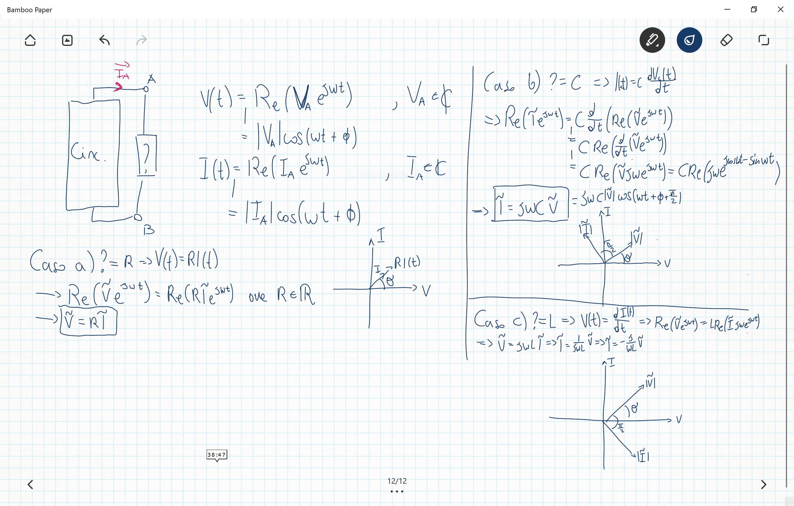

Fisica 2 - Lezione 12
=====================

La Risposta Sinusoidale:  
------------------------  

Vogliamo ora calcolare la risposta sinusoidale di un circuito LTI.  

  

Avendo parlato di fasori, definiamo quindi due nuove grandezze, chiamate **impedenza** ed **ammettenza** che saranno valori complessi, derivati dai fasori di tensione e corrente del circuito.  

  

  

  

Quella che abbiamo chiamato $H(j\omega)$ è la funzione di trasferimento dell'RLC.  
Vediamo quindi come l'RLC, dal grafico della $H(j\omega)$ si comporta da filtro passa-banda centrato in $\omega_0$.  

Ora di solito per esprimere questa relazione non si usa quasi mai la scala lineare bensì si esprime sempre la risposta in guadagno in scala logaritmica, in decibel $[dB] = 20log_{10}(\frac{Osservabile}{Riferimento})$.  
Per cui per esempio:  
$$V[dB]=20log_{10}(\frac{V_{osservabile[V]}}{V_{riferimento[V]}})$$  
Ricordandoci come si comporta la scala logaritmica:  
$$20dB = 20log_{10}(10)$$  
$$0dB = 20log_{10}(1)$$  
$$-20dB = 20log_{10}(0.1)$$  
$$-40dB = 20log_{10}(0.01)$$  
Per cui, definiamo la **frequenza di taglio** del filtro a $-3dB$, il motivo è che:  
$$-3dB = 20log_{10}(|H(j\omega)|)\Longrightarrow |H(j\omega)| = 10^{-3/20}\approx \frac{1}{\sqrt{2}}$$  
Ossia:  
$$|H(j\omega)| = \frac{1}{(1+Q^2(\frac{\omega}{\omega_0}-\frac{\omega_0}{\omega})^2)^{0.5}}=\frac{1}{\sqrt{2}}$$  
Implica che:  
$$1=Q^2(\frac{\omega}{\omega_0}-\frac{\omega_0}{\omega})^2\Longrightarrow Q(\frac{\omega}{\omega_0}-\frac{\omega_0}{\omega})=\pm1$$  
Caso 1)  
$$Q(\frac{\omega}{\omega_0}-\frac{\omega_0}{\omega})=1\Longrightarrow Q\omega_{3dB}^2-Q\omega_0^2=\omega_0\omega_{3dB}$$  
Caso 2)  
$$Q(\frac{\omega}{\omega_0}-\frac{\omega_0}{\omega})=-1\Longrightarrow Q\omega_{3dB}^2-Q\omega_0^2=-\omega_0\omega_{3dB}$$  
Troviamo le radici del primo caso:  
$$\omega_{3dB}=\frac{\frac{\omega_0}{Q}+\sqrt{\frac{\omega_0^2}{Q^2}+4\omega_0^2}}{2}$$  
Accettiamo solo la soluzione positiva in quanto l'altra soluzione sarebbe negativa, non accettabile.  
Troviamo le radici del secondo caso:  
$$\omega_{3dB}=\frac{-\frac{\omega_0}{Q}+\sqrt{\frac{\omega_0^2}{Q^2}+4\omega_0^2}}{2}$$  

Per cui le soluzioni sono:  
$$\omega_{3dB}=\sqrt{\frac{\omega_0^2}{Q^2}+4\omega_0^2}\mp\frac{\omega_0}{Q}$$  
Queste saranno le frequenze di taglio del nostro filtro passa banda.  
