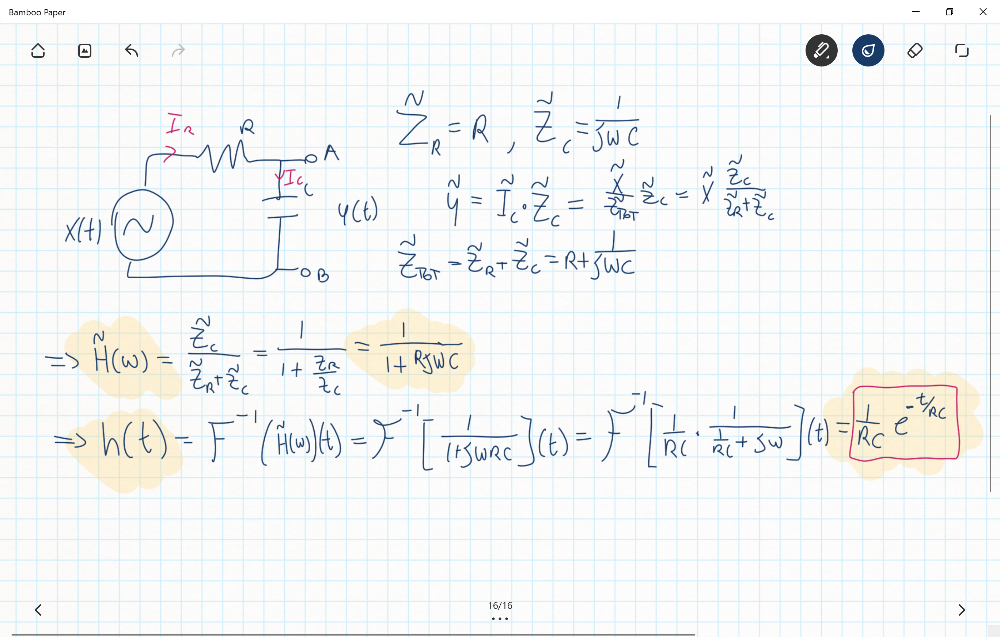

Fisica 2 - Lezione 14
=====================

Nell'ultima lezione abbiamo ricavato le equazioni della trasformata e dell'antitrasformata di fourier:  
$$F(\omega)=\frac{1}{\sqrt{2\pi}}\int_{-\infty}^{\infty}f(t)\cdot e^{-i\omega t}dt$$  
$$f(t)=\frac{1}{\sqrt{2\pi}}\int_{-\infty}^{\infty}F(\omega)\cdot e^{i\omega t}d\omega$$  
E ora sappiamo anche una delle più importanti proprietù della trasformata di fourier, ossia che:  
$$z(t)=x(t)*y(t)\Longrightarrow Z(\omega)=X(\omega)\cdot Y(\omega)$$  
E si può dimostrare che per un generico circuito LTI vale la relazione:  
$$y(t)=h(t)*x(t)$$  
Ove $h(t)$ è la risposta all'impulso del circuito.  

---
La Risposta Del Circuito RC:
----------------------------

Proviamo quindi ad applicare queste nuove conoscenze al circuito RC:  

  

Quindi abbiamo ricavato la risposta all'impulso del circuito RC senza risolvere alcuna equazione differenziale.  

---
La Trasformata Di Laplace:
--------------------------

Sappiamo che la trasformata di fourier è una mappa con kenel:  
$$k(\alpha, \beta) = e^{i\alpha\beta},\space\alpha,\beta\in\mathbb{R}$$  
Allora vogliamo creare una nuova trasformata più potente, che ci permette di generalizzare ulteriormente la trasformata di fourier.  
Definiamo quindi la **Trasformata Di Laplace** come quella trasformata il cui kernel è:  
$$k(\gamma, \beta) = e^{-\gamma\beta},\space\beta\in\mathbb{R},\gamma\in\mathbb{C}$$  
E quindi la trasformata sarà:  
$$F(s)=\int_{0}^{\infty}f(t)e^{-(a+i\omega)t}dt$$  
Ove $s=a+i\omega$.  
La Trasformata Di Laplace è rappresentato dall'integrazione in $[0, +\infty]$ e quindi funziona solo con funzioni causali, stiamo restringendo il nostro campo d'azione nel mondo causale, anche per questo la trasformata di laplace è più vicina al mondo fisico della trasformata di fourier che invece è più uno strumento matematico.  

Proprietà della trasformata di laplace:  
- Traslazione Temporale:  
  $\mathbb{L}[f(t-c)u(t-c)](s)=e^{-cs}\mathbb{L}[f(t)](s)$  
  Ossia la trasformata di una funzione traslata è uguale alla trasformata della funzione per un coefficiente $e^{-cs}$.  
- Derivazione:  
  $\mathbb{L}[f'(t)](s)=s\cdot\mathbb{L}[f(t)](s)-f(0)$
  Ossia la trasformata della derivata di una funzione è la trasformata della funzione moltiplicata per $s$ a cui sottraiamo le condizioni di contorno $f(0)$.  
  Fisicamente parlando è importantissima questa cosa, la trasformata di laplace tiene conto delle condizioni di contorno!  
  Ciò si può estendere alla derivata n-esima:  
  $\mathbb{L}[f^{(n)}(t)](s)=s^n\cdot\mathbb{L}[f(t)](s)-\sum_{i=1}^n s^{n-i}f^{(i-1)}(0)$  
- Integrazione:  
  $\mathbb{L}[\int_0^tf(\tau)d\tau](s)=\frac{1}{s}\mathbb{L}[f(t)](s)$  
  Ossia la trasformata dell'integrale di una funzione è la trasformata della funzione moltiplicata per $1/s$.  
- Convoluzione:  
  $\mathbb{L}[(f*g)(t)](s)=\mathbb{L}[f(t)](s)\cdot\mathbb{L}[g(t)](s)$  
  Ossia nel dominio di laplace, la convoluzione diventa un prodotto.  

La Trasformata Di Laplace di un generico segnale sarà sempre della forma:  
$$F(s)=\frac{b_0s^m+b_1s^{m-1}+...+b_{m-1}s+b_m}{a_0s^n+a_1s^{n-1}+...+a_{n-1}s+a_n}=\frac{P(s)}{Q(s)}$$  
Che si può sempre scrivere come:  
$$F(s)=k\frac{\Pi_{i=1}^{m}(s-z_i)}{\Pi_{i=1}^n(s-p_i)}$$  
Ossia come la divisione delle produttorie delle radici dei polinomi del numeratore e del denominatore.  
I $z_i$ sono gli zeri di $P(s)$ detti **zeri di F(s)**.  
I $p_i$ sono gli zeri di $Q(s)$ detti **poli di F(s)**.  
Dovremo quindi solo eseguire l'espansione in frazioni parziali per riuscire poi a calcolare l'antitrasformata.  
