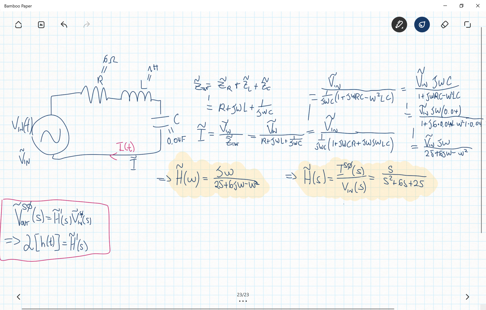

Fisica 2 - Lezione 16
=====================

Riprendendo dalla lezione precedente, proviamo a risolvere lo stesso circuito ma questa volta avvalendoci dei fasori.  

  

Notiamo come la $\tilde{H}(\omega)$ è molto simile alla $I(s)$ che avevamo trovato nella lezione precedente. Così simile che se poniamo $s=j\omega$ sono uguali, chiaramente dobbiamo chiederci se è lecito porre $s=j\omega$ e dobbiamo controllare le ROC della trasformazione da $I(t)$ ad $I(s)$, se comprendono l'asse immaginario allora sarà un'operazione lecita.  

Si può dimostrare infatti questa relazione:  

  

