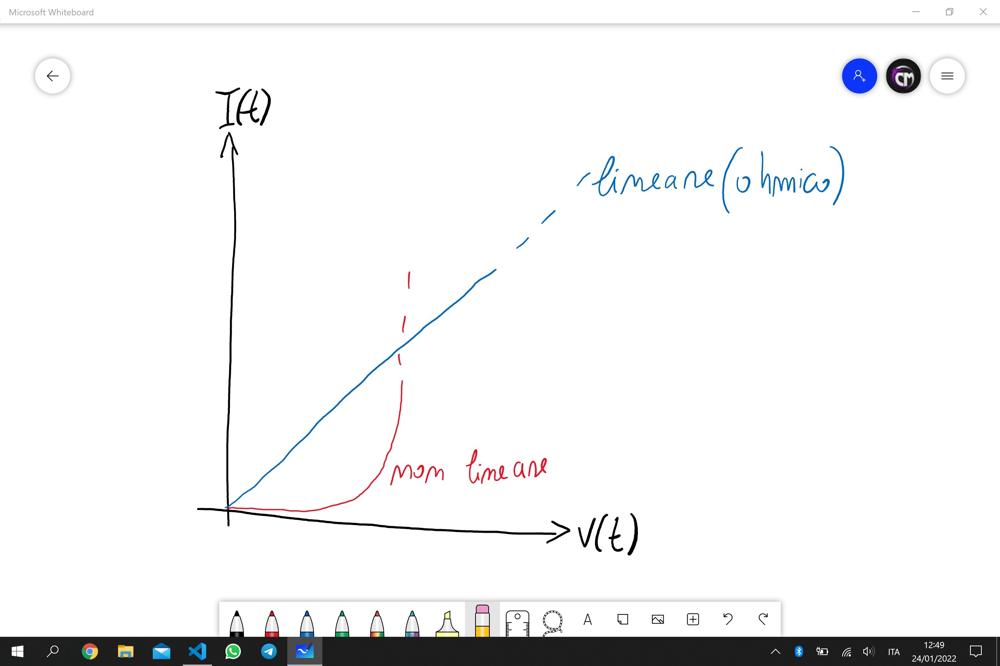
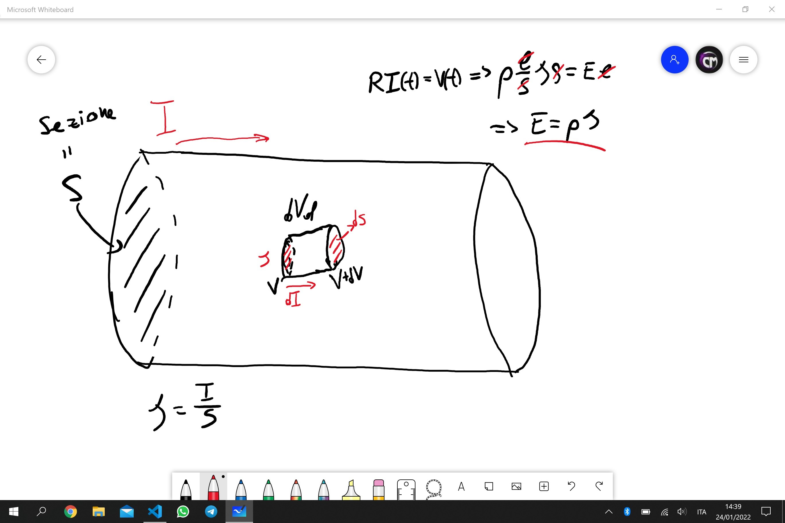
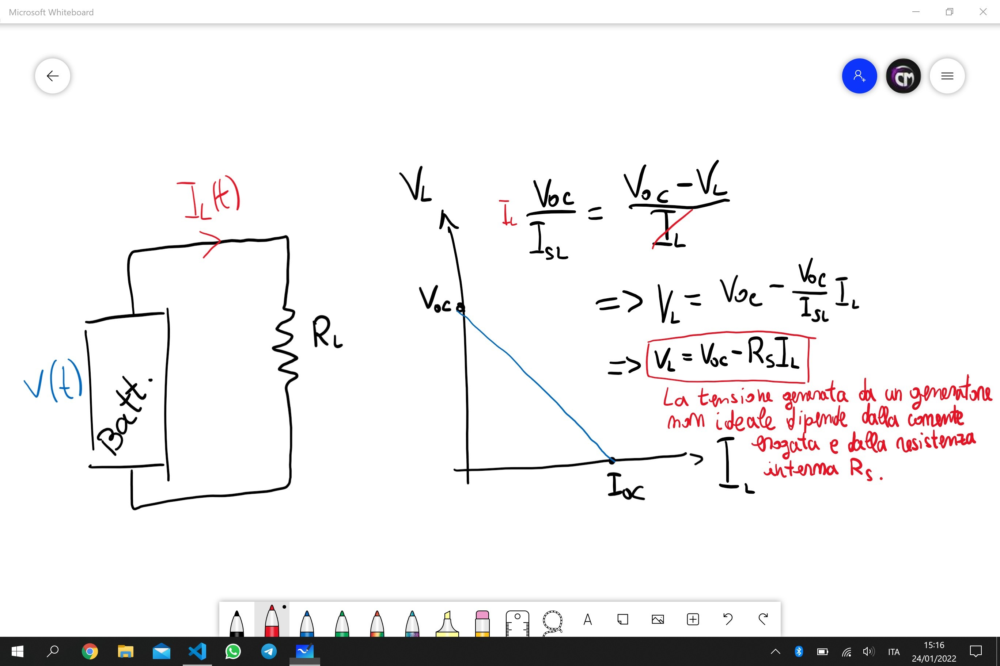
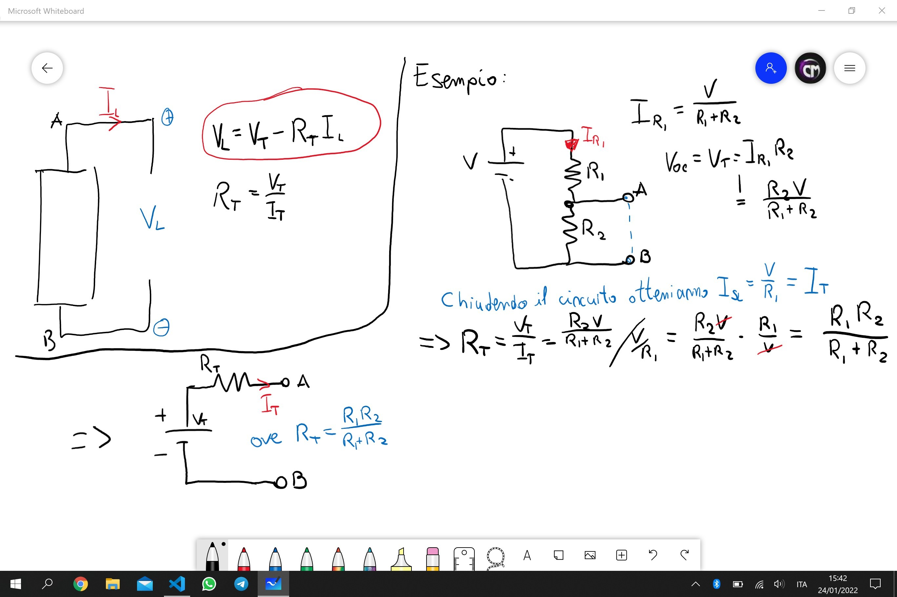
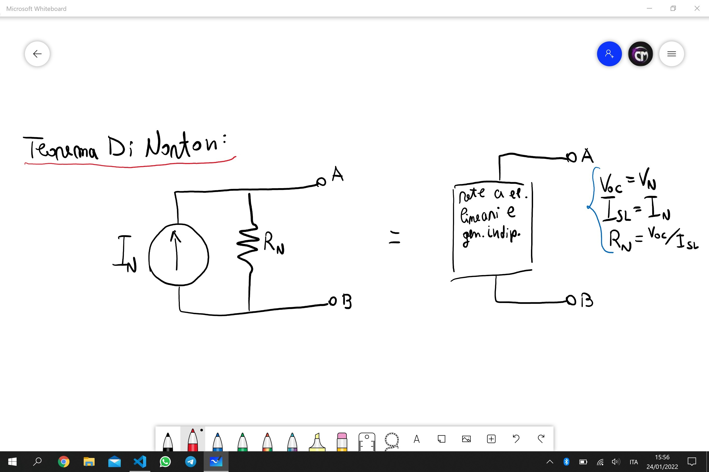
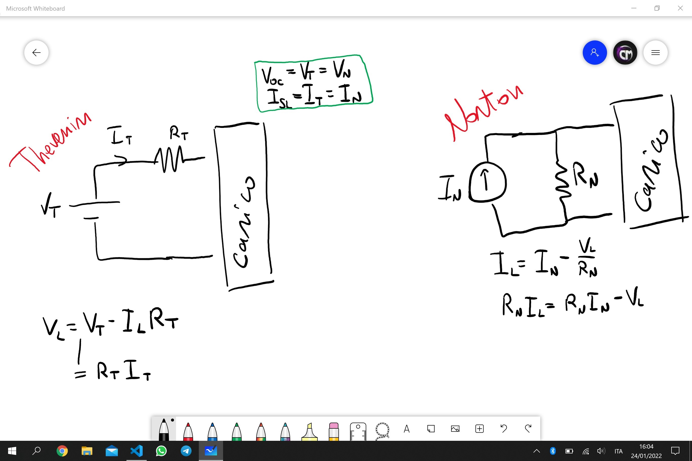

Fisica 2 - Lezione 2
====================

Resistenze:
-----------

Si possono distinguere in due categorie:  

E anche questi due tipi di resistenze possono essere tempo varianti o tempo invarianti.  

Una resistenza può essere per esempio un filo metallico, e la sua resistenza sarà funzione della lunghezza, della sezione e del materiale. $$R = \rho \cdot \frac{l}{s}$$ Ove vige la relazione $$\rho(T) = \rho(0)(1 + \alpha T)$$ per cui $\alpha$ dipende dal materiale.  
Nella costruzione di resistenze si punta a minimizzare il più possibile $\alpha$, in modo che la resistenza non vari molto in funzione della temperatura.  

Sapendo che $J = \frac{I}{S}$ e che $V(t)=RI(t)$ si può riscrivere la legge di Ohm come:  
$$\rho \cdot \frac{l}{s} \cdot JS = E \cdot l \longrightarrow E = \rho J $$  

---
Resistori Notabili:
-------------------

- I resistori LTI seguono l'equazione:  
$$V(t) = R(t) \cdot I(t) \space | \space R = const \space \forall t.$$  
- Resistore con $R=+\infty$: è un circuito aperto.
- Resistore con $R=0$: è un corto circuito.
- I resistori Lineari Tempo Varianti, detti anche 'trimmer'.  
Esempio:  
$$R(t) = R_{1} + R_{2}cos(2\pi f_{1}t)$$  
$$I(t) = I_{0}cos(2\pi f_{2}t)$$  
$$V(t) = I_{0}R_{1}cos(2\pi f_{2}t) + \frac{R_{2}I_{0}}{2}cos(2\pi(f_{1}+f{2})t) + \frac{R_{2}I_{0}}{2}cos(2\pi(f_{1}-f_{2})t)$$  

---
I Generatori:
-------------

- Generatori Di Tensione:  
Un generatore di tensione è un elemento circuitale a due terminali che mantiene una certa tensione ai capi dei terminali per ogni corrente $I(t)$ che fluisce attraverso di esso.  
La batteria è un esempio di generatore di tensione.  
Spegnere un generatore di tensione equivale ad un cortocircuito.  
- Generatori Di Corrente:
Un generatore di corrente è un elemento circuitale a due terminali che mantiene una certa corrente ai capi dei terminali per ogni tensione $V(t)$ che fluisce attraverso di esso.
Spegnere un generatore di corrente equivale ad un circuito aperto.  

Un generatore non ideale di tensione:

  

Segue l'equazione: $V_{L} = V_{OC} - R_{S}I_{L}$  
Ossia la tensione erogata dipende dalla corrente erogata e dalla resistenza interna, e quindi dalla qualità costruttiva.  
Ciò implica che possiamo modellare un generatore reale come un generatore reale con una resistenza parasidica in serie.

---
Il Teorema Di Thevenin:
-----------------------

Qualsiasi circuito a due terminali contenente dei generatori indipendenti complesso a piacere è sempre riportabile ad un circuito equivalente composto da un generatore di tensione in serie ad un resistore.  

  

---
Il Teorema Di Norton:
---------------------

Qualsiasi circuito a due terminali costituito da elementi lineari e generatori indipendenti complesso a piacere è equivalente ad una sorgente di corrente con un resistore in parallelo.  

  

Si noti la similarità tra i due teoremi.  
Esempio di applicazione di entrambi:  

  

La potenza di un circuito si definisce come: $P_{L} = V_{L} \cdot I_{L}$  
Se $R_{L} = 0 \Longrightarrow V_{L} = 0V, I_{L} = \frac{V}{R_{S}} \Longrightarrow P_{L} = 0W$  
Se $R_{L} = \infty \Longrightarrow V_{L} = V, I_{L} = 0A \Longrightarrow P_{L} = 0W$  

Per un circuito generico contenente un generatore di tensione ideale con resistenza parasidica in serie, ed una resistenza di carico sappiamo che:  
$$P_{L} = V_{L}I_{L} = R_{L}I_{L}^2 = \frac{V_{L}^2}{R_{L}}$$  
$$V_{L} = \frac{VR_{L}}{R_{S}+R_{L}} \cdot \frac{V}{R_{S}+R_{L}} = \frac{V^2R_{L}}{(R_{S}+R_{L})^2} = \frac{V^2}{(\frac{R_{S}^2}{R_{L}}+R_{L}+2R_{S})}$$  
Volendo massimizzare la potenza deriviamo per $R_{L}$:  
$$\frac{d}{dR_{L}}(\frac{R_{S}^2}{R_{L}}+R_{L}+2R_{S}) = -\frac{R_{S}^2}{R_{L}^2}+1 = 0$$  
Ciò implica che: $R_{S} = \sqrt{R_{L}^2} = R_{L}.$
Ossia, per ottenere la potenza massima possibile, il nostro circuito dovrà avere una resistenza di carico $R_{L}$ uguale alla resistenza parasidica del generatore $R_{S}$.  
