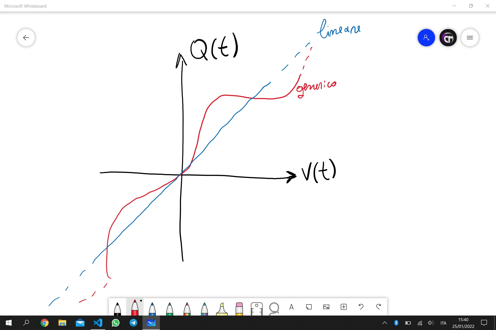
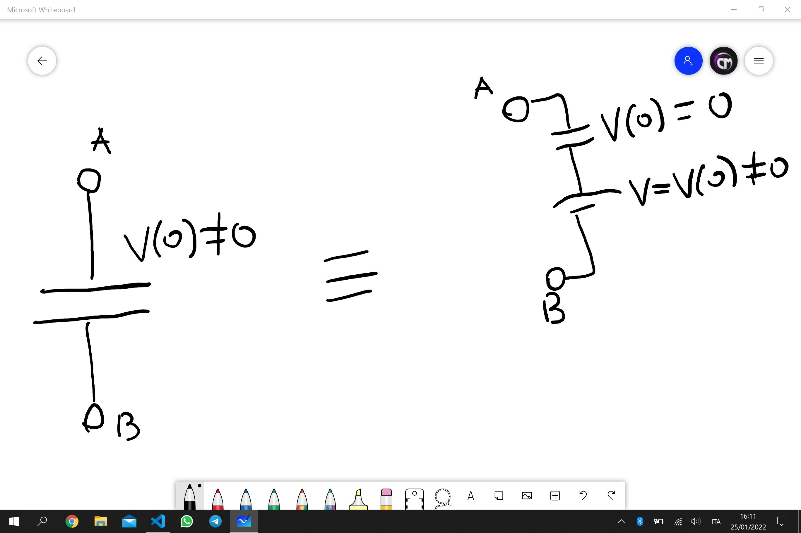
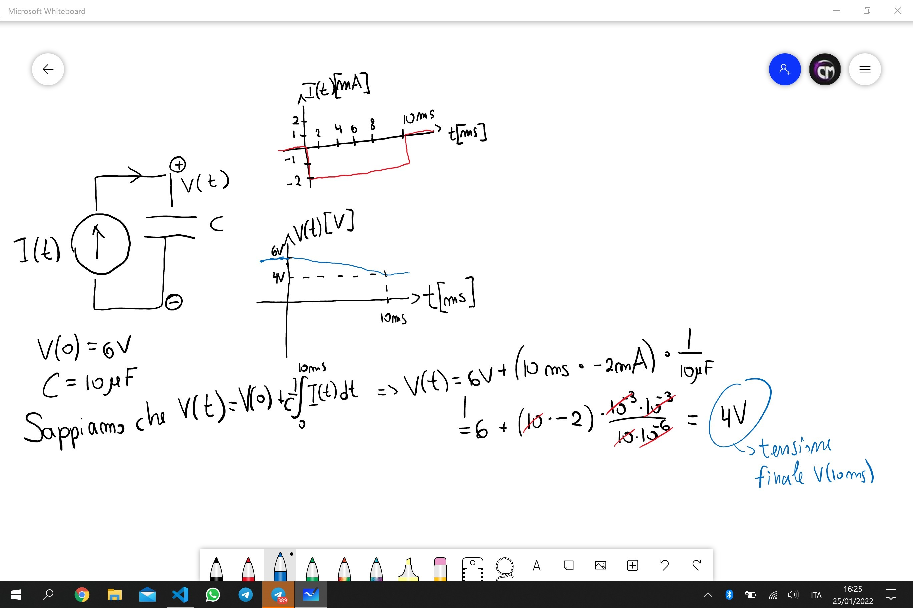

Fisica 2 - Lezione 3
====================

Condensatori:
-------------

Possono essere sia lineari che non. In ogni caso si tratta di componenti elettriche che mettono in relazione tensione e carica.

  

Noi studieremo i condensatori lineari, ossia quelli che soddisfano la relazione: $Q(t) = C(t)V(t) : C(t) = const \space \forall t.$  

---
I Condensatori LTI:
-------------------

Seguono l'equazione fondamentale: $Q(t) = C\cdot V(t).$  
Noi sappiamo che: $I(t) = \frac{d}{dt}Q(t) = \frac{d}{dt}(C\cdot V(t)) = C\cdot\frac{dV(t)}{dt}$  
Da ciò possiamo ricavare un'equazione in cui esplicitiamo la tensione:  
$$\int_{0}^t{I(\tau)d\tau} = \int_{0}^t{C\frac{d}{dt}V(t)dt} = \int_{V(0)}^{V(t)}{C\cdot dV(\tau)}$$  
Da cui ricaviamo che: $V(t)-V(0) = \frac{1}{C}\int_{a}^b{I(\tau)d\tau}$  
Queste saranno le equazioni fondamentali dei condensatori lineari:  
$$I(t) = C\cdot\frac{d}{dt}V(t)$$  
$$\Delta V = \int_{a}^{b}{I(\tau)d\tau}$$  
Quest'ultima equazione è spesso scritta nella forma:  
$$V(t) = V(0) + \int_{0}^{t}{I(\tau)d\tau}$$  
Questa equazione in particolare ha delle implicazioni importanti, ci dice che la tensione ad un dato istante dipende dal passato del condensatore. Si può quindi modellare un condensatore carico a $V(0) = V_{0}$ come un circuito composto dallo stesso condensatore scarico in serie ad un generatore di tensione con tensione nominale $V_0$.  

  

Un esempio di utilizzo di queste formule:  

  

Inoltre ricordiamo che la tensione di un condensatore è una quantità continua, a prescindere dal comportamento della corrente.  
Fisicamente parlando un condensatore è formato da due piastre metalliche parallele, la capacità è funzione della geometria: $C = \frac{\epsilon_{0}\cdot S}{d}$  

---
Induttori:
----------

E' un componente a due terminali che per ogni tempo 't' è caratterizzato dall'imporre una relazione ben definita tra il flusso del campo magnetico e la corrente che lo attraversa: $\Phi(B(t)) = f(I(t))$.  
In particolare noi studieremo gli induttori lineari tempo invarianti per cui vige la relazione: $\Phi(B(t)) = L(t)I(t) : L(t) = L = const \space \forall t$.  
Questa relazione di per se però non ci aiuta molto nella risoluzione di un circuito. Però noi sappiamo grazie alla legge di faraday che:  
$$\Delta V(t) = \frac{d\Phi(B(t))}{dt} = \frac{d}{dt}(L\cdot I(t))$$  
Da cui ricaviamo la relazione:  
$$\Delta V(t) = L\cdot\frac{dI(t)}{dt}$$  
Che ci dice che la tensione di un induttore è funzione della variazione della corrente che lo attraversa.  
Potrebbe tornare utile avere una relazione che esplica la corrente in funzione del tempo:  
$$I(t)-I(0)=\frac{1}{L}\int_{0}^{t}V(\tau)d\tau$$  
Scritto spesso come:  
$$I(t) = I(0) + \frac{1}{L}\int_{0}^{t}V(\tau)d\tau$$  
Equazione molto importante che ci dice che la corrente sarà sempre continua, a prescindere dalla forma d'onda della tensione.  
Fisicamente parlando, un induttore è un pacco di spire, detto anche solenoide, e l'induttanza è funzione della geometria:  
$$B_{0} = \mu_{0}\frac{N}{l}I$$  
$$\Phi(B_{0}) = NSB_{0}$$  
Da cui ricaviamo che:  
$$L = \mu_{0}\pi R^2\cdot\frac{N^2}{l}$$  
