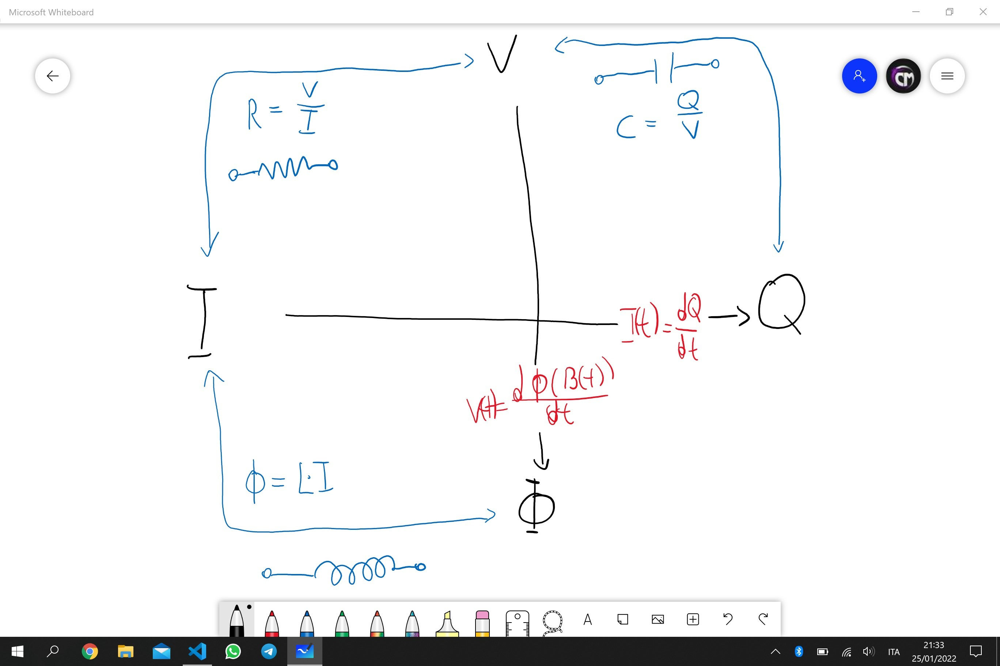
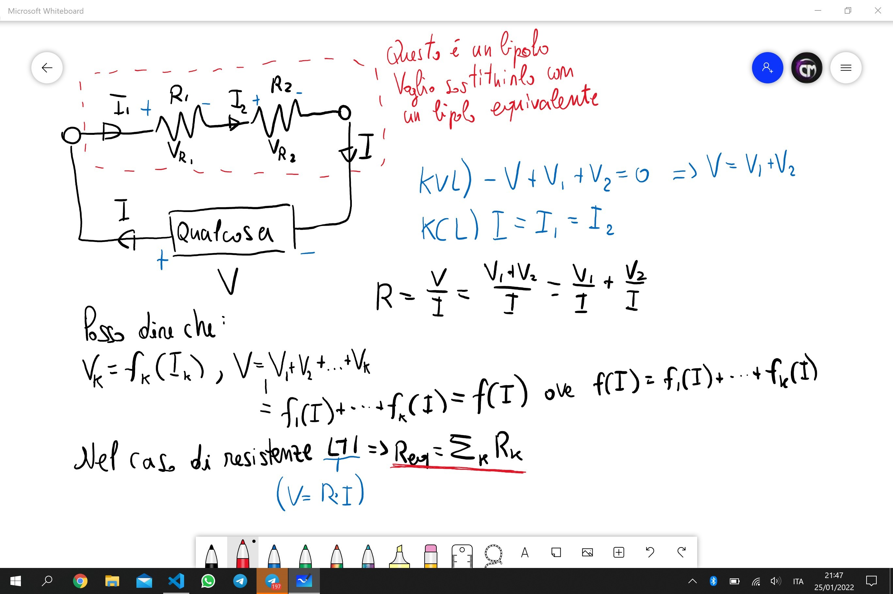
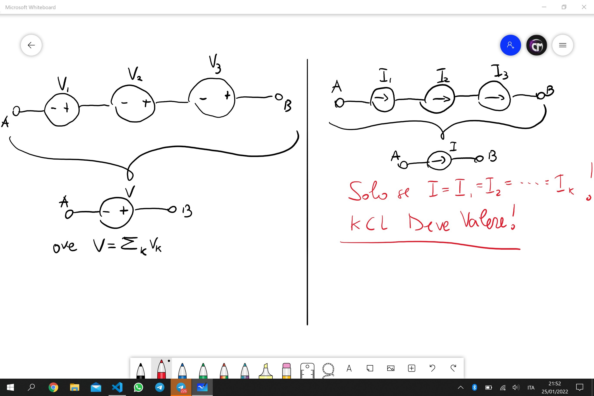
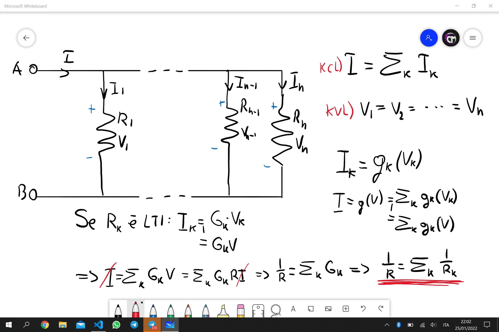
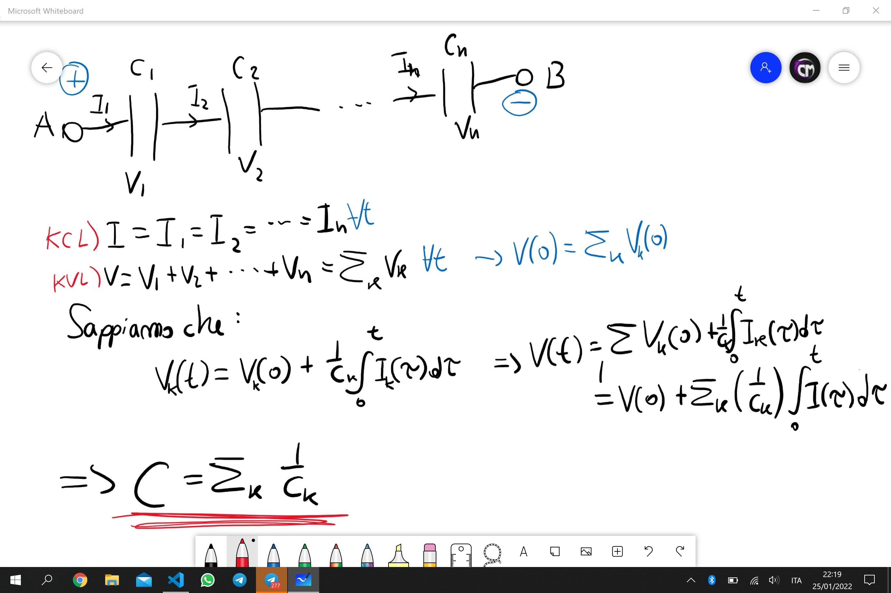
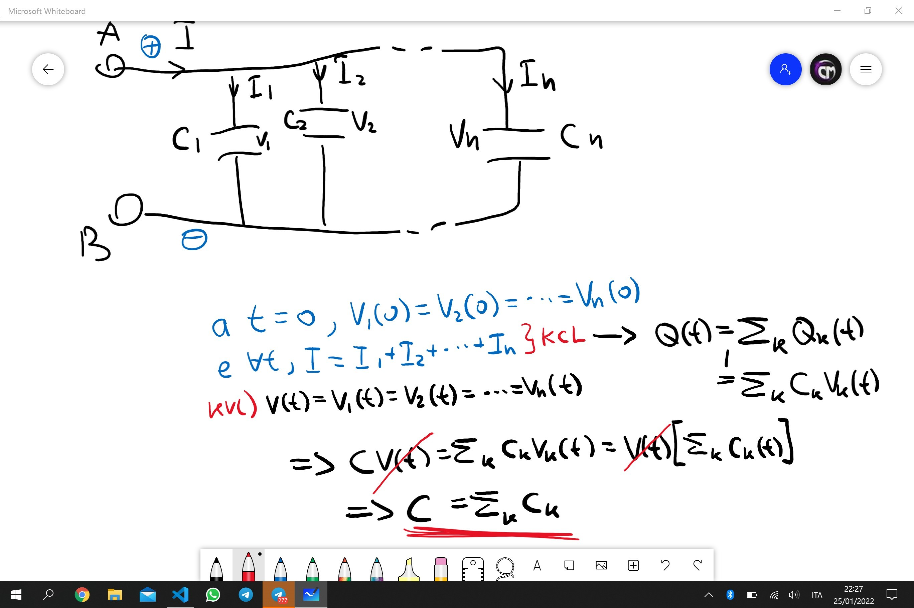
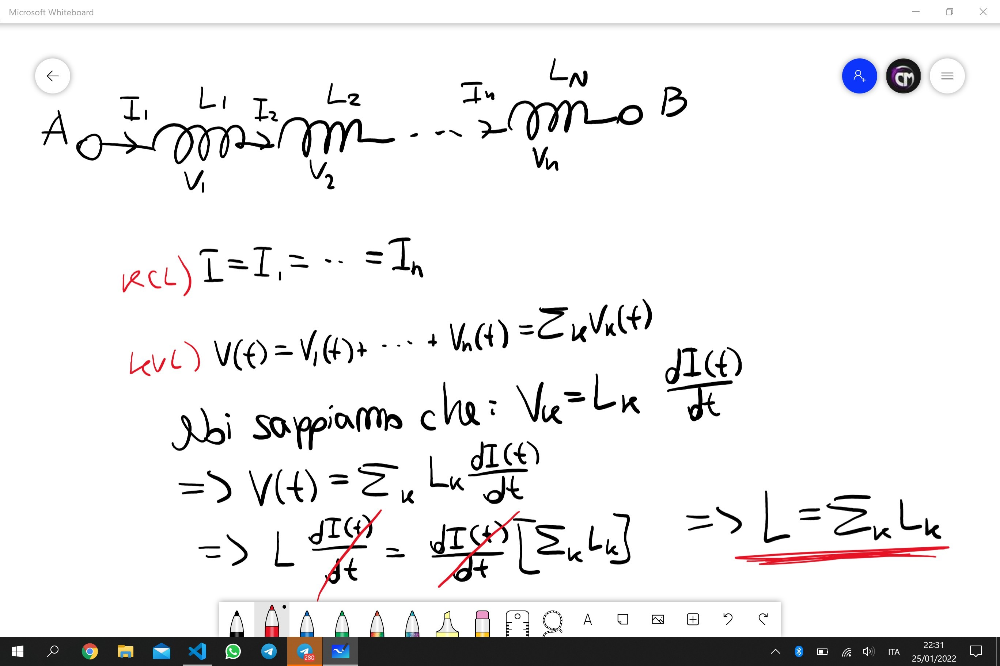
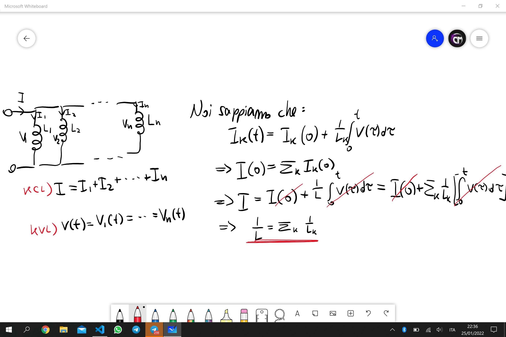
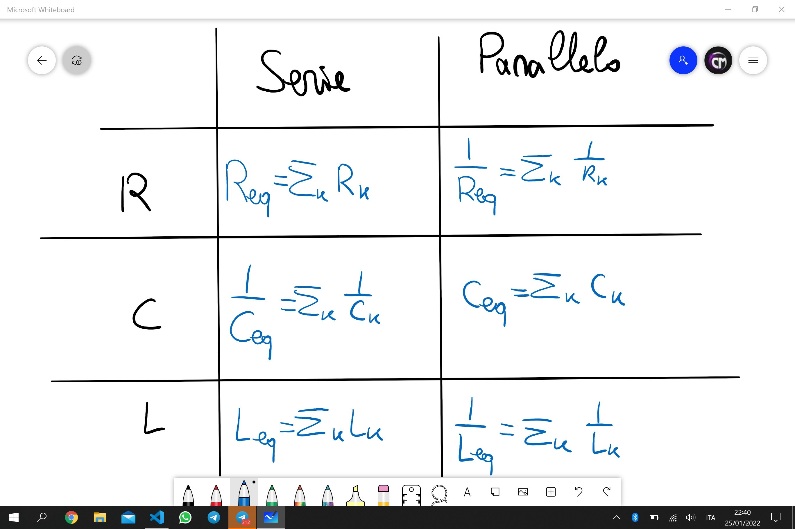

Fisica 2 - Lezione 4
====================

Il Solenoide:
-------------

Per ricavare il coefficiente di autoinduzione $L$ di un solenoide, immaginiamo di averne uno infinito.  
Definiamo la densità di spire come $n = \frac{N}{l}$.  
Noi sappiamo che gli induttori seguono la legge: $\Phi(B(t)) = L\cdot I(t)$.  
Preso un cammino chiuso perpendicolare alle spire otteniamo che $B_{0} = \mu_{0}\frac{N}{l}I\space$, e $\Phi(B_{0}) = B_{0}NS = \mu_{0}\frac{N}{l}INS$.  
Per cui otteniamo: $L = \mu_{0}\frac{N^2}{l}\pi R^2 = \mu_{0}n^2l\pi R^2$.  

---
Potenza Ed Energia:
-------------------

Dato un circuito composto da un generatore ed un bipolo, ossia un componente di un circuito formato da un ingresso e da un'uscita, la corrente entrante dovrà per forza essere uguale alla corrente uscente, e ai capi di questi poli ci sarà una certa differenza di potenziale, la potenza si può calcolare come $P(t) = V(t)I(t)$.  
Mentre l'energia si può calcolare come $E(t_{1}, t_{2}) = \int_{t_{1}}^{t_{2}}P(\tau)d\tau$.  

  

Preso un **resistore** generico, non necessariamente lineare, se i punti della retta sul grafico di tensione e corrente sono sul primo e terzo quadrante, il resistore ad ogni istante avrà una potenza positiva,e quindi si chiama componente passivo, in quanto dissipa energia.  

  

Preso un **condensatore** generico, l'energia necessaria a caricarlo sarà data dalla stessa formula: $E(t_{1}, t_{2}) = \int_{t_{1}}^{t_{2}}V(\tau)I(\tau)d\tau=\int_{t_{1}}^{t_{2}}V(\tau)\frac{dQ(\tau)}{d\tau}d\tau$  
Ciò si può riscrivere come:  
$$E(t_{1}, t_{2}) = \int_{Q(t_{1})}^{Q(t_{2})}V(Q)dQ = \int_{Q(t_{1})}^{Q(t_{2})}\frac{Q(t)}{C}dQ=\frac{1}{2C}Q^2$$  
Posto che $Q(t_{1}) = 0 \space \land Q(t_{2}) = Q$.  

  

Preso un **induttore** generico, l'energia necessaria a caricarne il campo magnetico si può definire come:  
$$E(t_{1}, t_{2}) = \int_{t_{1}}^{t_{2}}V(\tau)I(\tau)d\tau=\int_{t_{1}}^{t_{2}}\frac{d\Phi(B(t))}{dt}\cdot \frac{\Phi(B(t))}{L}dt$$
Ciò si può riscrivere come:  
$$\int_{\Phi(B(t_{1}))}^{\Phi(B(t_{2}))}\frac{\Phi(B(t))}{L}d\Phi(B(t)) = \frac{\Phi(B(t))^2}{2L}=\frac{LI^2(t)}{2}$$  

---
Diagramma Riassuntivo:
----------------------

Riporto qui sotto un diagramma riassuntivo di tutte le componenti studiate nelle ultime lezioni, e tutte le relazioni più importanti che comportano.  

  

---
Reti di Resistori:
------------------

Nel caso di resistenze in serie, si può dimostrare che $R_{eq} = \Sigma_{i=1}^{n}R_i$.  

  

Nel caso di generatori in serie, se sono di tensione si possono banalmente sommare le tensioni, mentre nel caso di generatori di corrente bisogna far attenzione che KCL deve valere!  

  

Nel caso di resistori in parallelo invece, si può dimostrare che $\frac{1}{R_{eq}} = \frac{1}{\Sigma_{i=1}^{n}R_i}$.  

  

Nel caso di condensatori in serie, si può dimostrare che $\frac{1}{C_{eq}} = \Sigma_{i=1}^{n}\frac{1}{C_i}$.  

  

Nel caso di condensatori in parallelo invece, si può dimostrare che $C_{eq} = \Sigma_{i=1}^{n}C_i$.  

  

Nel caso di induttori in serie, si può dimostrare che $L_{eq} = \Sigma_{i=1}^{n}L_i$.  

  

Nel caso di induttori in parallelo, si può dimostrare che $L_{eq} = \frac{1}{\Sigma_{i=1}^{n}\frac{1}{L_i}}$.

  

Quindi possiamo riassumere in un diagramma riassuntivo tutto ciò:

  

