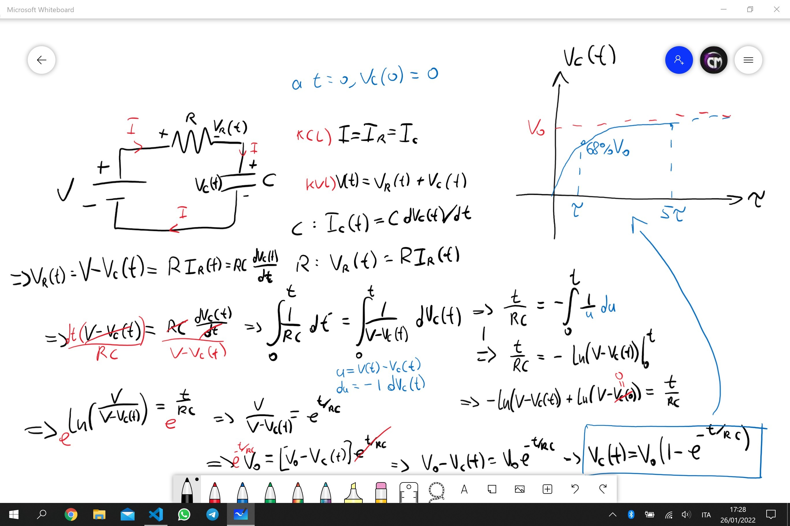
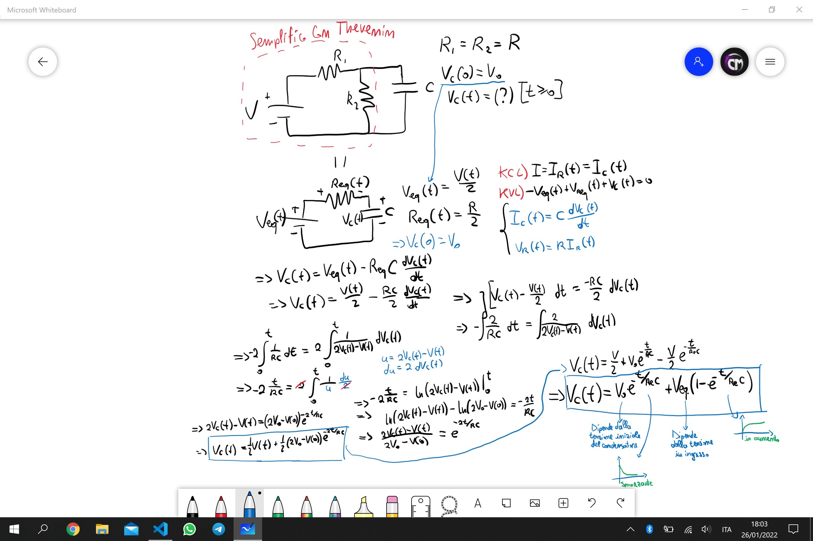

Fisica 2 - Lezione 5
====================

Principio Della Sovrapposizione:
--------------------------------

Si definisce un circuito lineare, un circuito formato da elementi passivi lineari accoppiati da generatori indipendenti.  
Si definisce un circuito tempo invariante se gli elementi passivi sono tempo invarianti, i generatori basta che siano indipendenti.  
Il principio della sovrapposizione ci dice che in un circuito lineare, contenente più generatori indipendenti, la corrente/tensione di lato di una componente è equivalente alla somma algebrica delle correnti/tensioni di lato di tali componenti in tutti i circuiti composti dalla stessa rete ed un solo generatore acceso alla volta.

Esempio:

  

Torna comodo in certe situazione per evitare di scomodare le leggi di kirchhoff dei nodi e delle maglie.  

---
Lo switch:
----------

All'interno di un circuito si può trovare una componente che fa da selettore all'interno del circuito, e quindi a seconda della sua posizione conclude un circuito a se stante.

Esempio:

  

---
Risposta Ad Ingresso Zero:
--------------------------

Proviamo ora a descrivere la carica del condensatore, da scarico, allo stesso modo in cui abbiamo calcolato la sua scarica nell'esempio precedente.  

  

Se risolvo il circuito soggetto ad un ingresso nel momento in cui non c'è energia immagazzinata in alcuna componente(capacitiva/induttiva) allora tale risposta è detta risposta a stato zero.  

Quindi nel caso di un circuito RC, sappiamo che:
- La risposta con ingresso zero è: $V_{C}(t) = V_{0}\cdot e^{-\frac{t}{RC}}$  
- La risposta a stato zero è: $V_{C}(t) = V_{0}(1-e^{-\frac{t}{RC}})$  

Studiamo quindi un RC più complesso, dove ci avvaliamo di Thevenin e poi proviamo a risolvere le equazioni per la carica di un condensatore parzialmente carico a $t = t_{0}$.  

  

