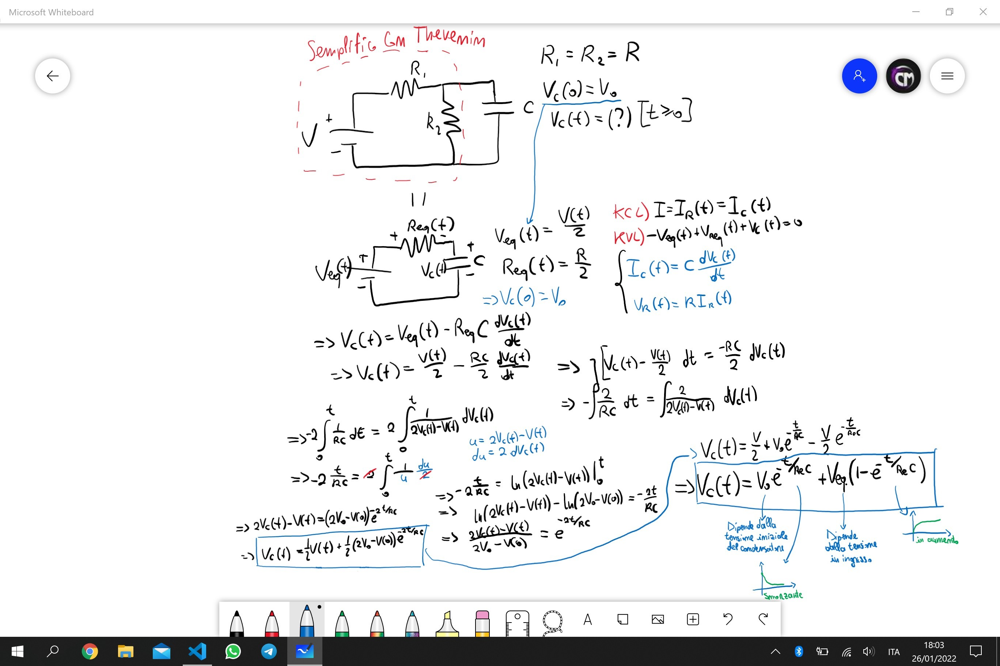
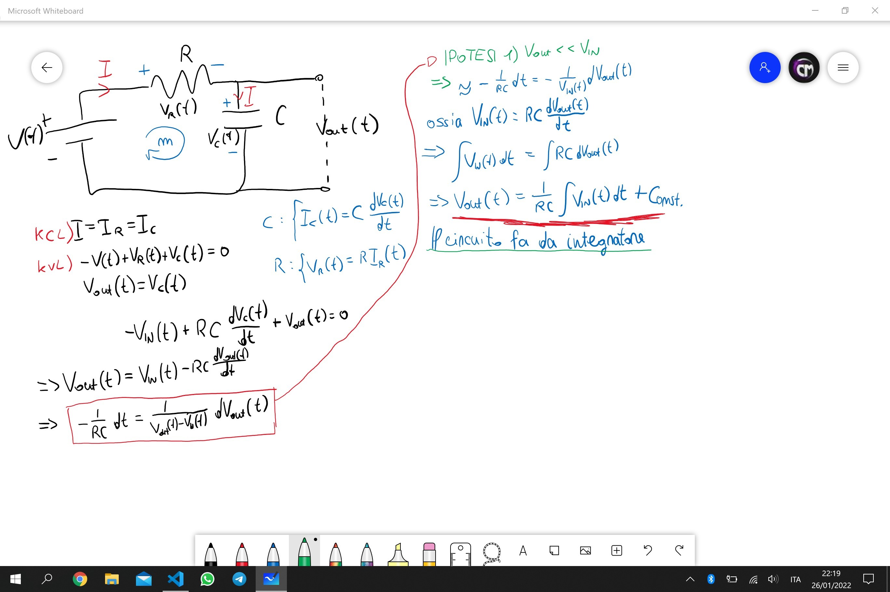
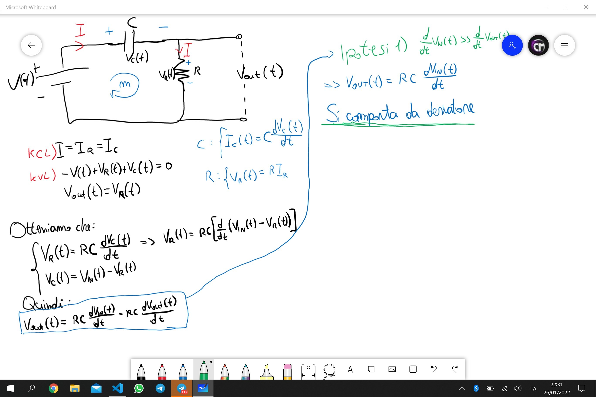
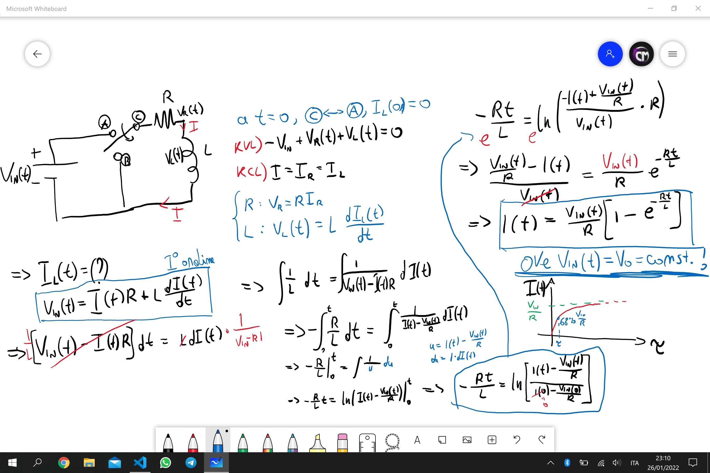
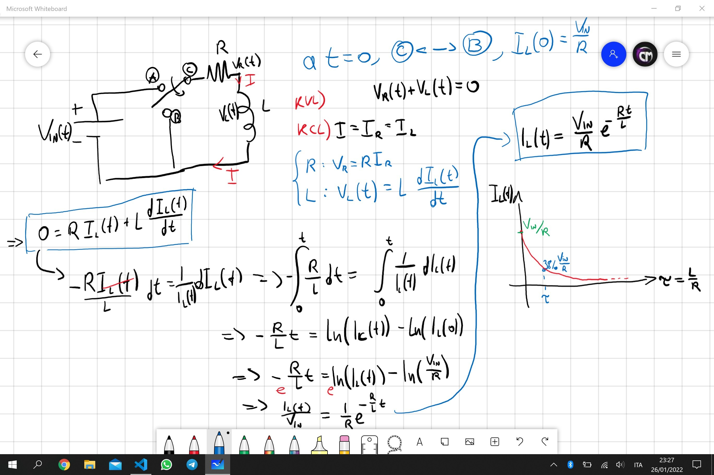

Fisica 2 - Lezione 6
====================

Il circuito RC:
---------------

Riprendendo da dove ci siamo lasciati nella lezione precedente, avevamo calcolato analiticamente applicando le leggi di kirchoff la risposta generale di un circuito RC, ad un segnale, con condensatore parzialmente carico.

  

Notiamo che questa equazione:  
$$V_{C}(t) = V_{0}e^{-\frac{t}{R_{eq}C}}+V_{eq}(1-e^{-\frac{t}{R_{eq}C}})$$  
**E' la somma algebrica di risposta a stato zero e risposta ad ingresso zero**, infatti:
- Risposta Ad Ingresso Zero: $V_{0}\cdot e^{-\frac{t}{R_{eq}C}}$  
- Risposta A Stato Zero: $V_{eq}(1-e^{-\frac{t}{R_{eq}C}})$  

Questa proprietà si preserva nei circuiti lineari.
La risposta generale di un circuito è data dalla somma della risposta a stato zero e la risposta ad ingresso zero.  

Proviamo quindi a dimostrarlo, partendo dall'equazione differenziale:  
$$\frac{d}{dt}V_{C}(t)+\frac{1}{R_{eq}C}V_{C}(t)=\frac{1}{R_{eq}C}V_{eq}$$  
Dividiamo quindi il problema nei due casi:  
- Il caso della **risposta ad ingresso zero**:  
E quindi otteniamo l'equazione omogenea associata:  
$$\frac{d}{dt}V_{C}^{O}(t)+\frac{1}{R_{eq}C}V_{C}^{O}(t)=0$$  
- Il caso della **risposta a stato zero**:  
Da cui otteniamo l'equazione non omogenea:  
$$\frac{d}{dt}V_{C}^{NO}(t)+\frac{1}{R_{eq}C}V_{C}^{NO}(t)=\frac{1}{R_{eq}C}V_{eq}$$  
Ricordiamoci inoltre che dividendo il problema in due, nel caso della risposta ad ingresso zero dobbiamo ricordare che $V_{C}^{O}(0) = V_{0}$, mentre nel caso della risposta a stato zero $V_{C}^{NO}(0) = 0$.  

A questo punto sommiamo le due equazioni e otteniamo:  
$$\frac{d}{dt}(V_{C}^{O}(t)+V_{C}^{NO}(t))+\frac{1}{R_{eq}C}(V_{C}^{O}(t)+V_{C}^{NO}(t))=\frac{1}{R_{eq}C}V_{eq}$$  
E ricordiamo anche di sommare le condizioni iniziali, quindi: $V_{C}(0)=V_{0}+0$.  
Da qua è facile notare che, essendo questa e l'equazione differenziale iniziale perfettamente equivalenti, ed essendo entrambi problemi di Cauchy, ossia problemi ad una sola soluzione, con le stesse condizioni di bordo, deve per forza valere la relazione: $V_{C}(t) = V_{C}^{O}(t)+V_{C}^{NO}(t)$.  
In altre parole, **la risposta generale di un circuito RC è data dalla somma della risposta ad ingresso zero e la risposta a stato zero**.  
Si può inoltre dimostrare che l'equazione differenziale iniziale è una funzione lineare, quindi: $f(\alpha x(t)+\beta y(t))=\alpha f(x(t))+\beta f(y(t))$, ed in particolare si può dimostrare che la risposta a stato zero è una funzione lineare.

---
Il Principio Di Sovrapposizione:
--------------------------------

Possiamo quindi affermare, avendolo dimostrato formalmente, ciò che ci dice il Principio Di Sovrapposizione:  
**La risposta di una rete lineare con stato zero dovuta a tutti i generatori indipendenti è equivalente alla somma delle risposte a stato zero dovute ai singoli generatori indipendenti.**  

---
I filtri RC:
------------

Ridisegniamo il circuito RC ponendo due capi alle estremità del condensatore, come se fosse un bipolo.  
Notiamo che, risolvendo l'equazione differenziale, sotto la supposizione che $V_{IN}\gg V_{OUT}$, il circuito RC si comporta da integratore, ossia $V_{OUT}$ è determinato dall'integrale di $V_{IN}$ a meno di una costante $\frac{1}{RC}$.  

  

Notiamo un comportamento del circuito, sotto queste condizioni, di tipo integrativo, ossia $V_{OUT}$ amplifica le lente fluttuazioni di tensione e riduce le veloci fluttuazioni di tensione di $V_{IN}$.  

Ridisegnando lo stesso circuito, ma questa volta scambiando resistenza e condensatore otteniamo:  

  

Notiamo un comportamento diverso del circuito, sotto queste nuove condizioni. Ossia si comporta da derivatore, amplificando le veloci fluttuazioni di tensione e riducendo le lente fluttuazioni di tensione di $V_{IN}$.  

Da ciò ricaviamo uno dei motivi più comuni per cui si incontrano gli RC all'interno dei circuiti elettrici:  
- Svolgono il lavoro di un filtro, una resistenza ed una resistenza in serie fanno si che il secondo capo del condensatore avrà una tensione che è equivalente a quella di ingresso a meno della componente continua, e quindi svolge il lavoro di tagliare la componente continua della forma d'onda, anche detto *coupling AC*.  
- Se incontrati come nei circuiti negli esempi prima citati svolgono il lavoro rispettivamente di filtri passa-basso(integrativo) e passa-alto(derivativo).  

---
Il circuito RL:
---------------

Proviamo ora a scambiare il condensatore con un induttore.

  

Notiamo che la corrente che scorre nell'induttore istantaneamente sarà nulla e col passare del tempo incrementerà con un andamento identico alla tensione nel caso della carica di un condensatore, a meno di costanti moltiplicative e di tempo.  
Anche in questo caso possiamo definire una costante di tempo $\tau = \frac{L}{R}$.  

Ora studiamo il comportamento del circuito RL in scarica, quando il campo magnetico dell'induttore è carico, ossia la corrente che scorre per l'induttore è massima, e viene chiuso il circuito staccando la batteria.  

  

Notiamo che l'equazione che determina l'andamento della corrente attraverso l'induttore è la stessa che determina l'andamento della tensione attraverso il condensatore, a meno di costanti moltiplicative e di tempo.  
Ricordiamo inoltre che $V_{L}=-V_{R}=-V_{IN}\cdot e^{-\frac{R}{L}t}$, ossia **la tensione attraverso l'induttore è in opposizione a quella attraverso il resistore, in quanto egli si oppone alla variazione di corrente!**  
