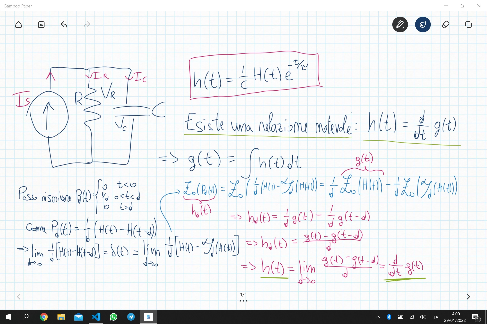
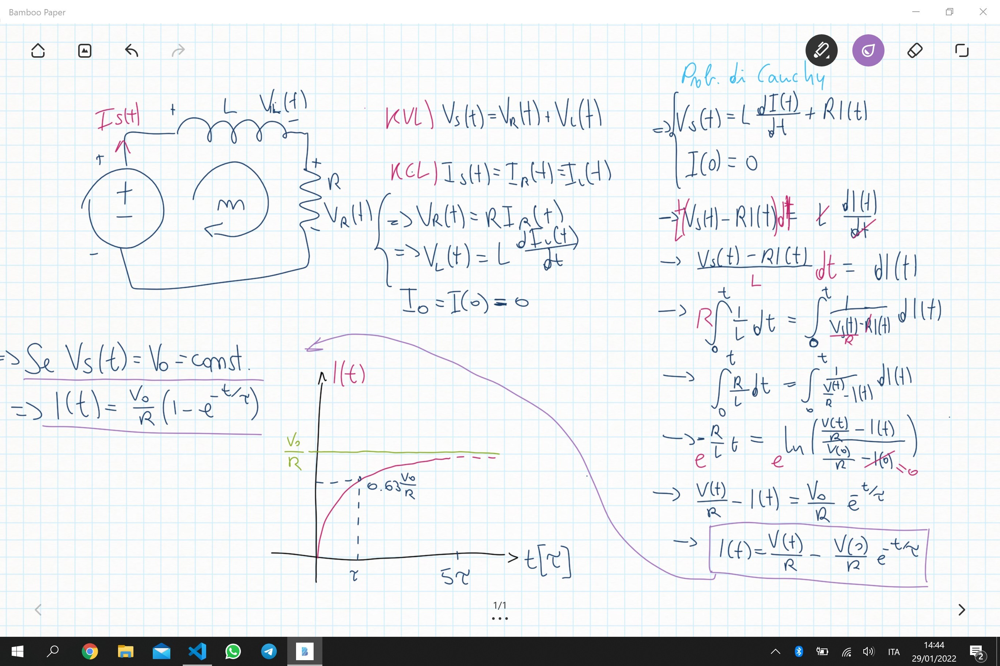
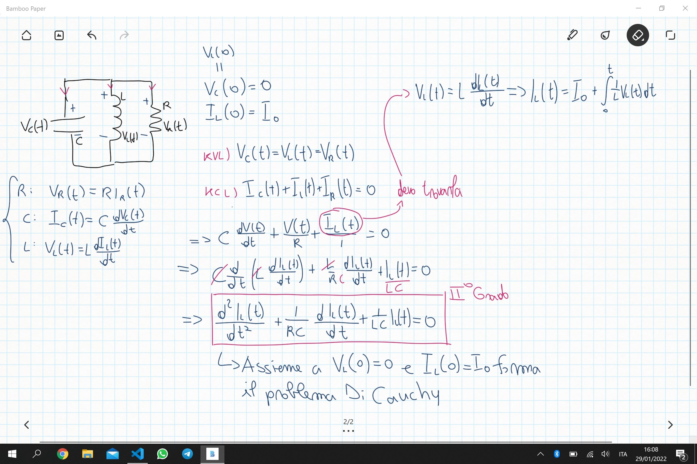
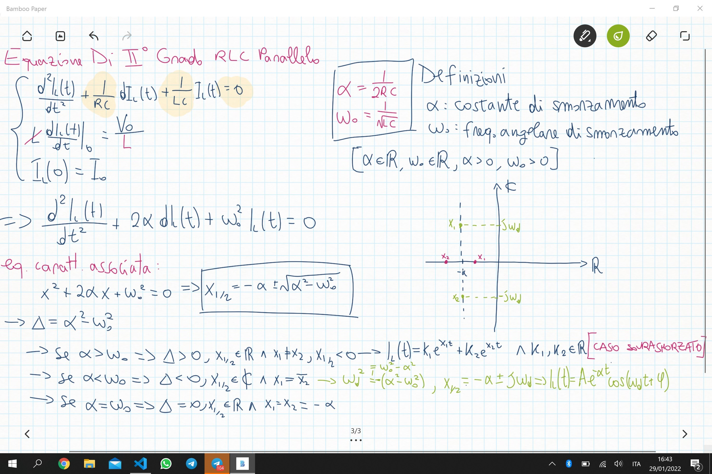

Fisica 2 - Lezione 8
====================

Le risposte al gradino ed all'impulso:
--------------------------------------

Nell'ultima lezione ci siamo lasciati dichiarando una proprietà importantissima dei circuiti lineari, ossia che la risposta impulsiva non è altro che la derivata della risposta al gradino:  
$$h(t) = \frac{d}{dt}g(t)$$  
Possiamo dimostrarlo prendendo in esame il circuito studiato l'ultima volta:  

  

Come possiamo vedere, sfruttando alcune proprietà degli operatori definiti a lezione, e ridefinendo $P_{d}(t)$ con l'utilizzo della funzione di Heaviside, riusciamo a dimostrare matematicamente che $h(t)$ è la derivata della risposta al gradino del circuito, per ogni circuito lineare.  

---
Esercizio Per Casa:
-------------------

Ci viene proposto di applicare questa proprietà su un circuito RL in serie, calcolando quindi entrambe le risposte e provando a verificare che la risposta all'impulso sia effettivamente pari alla derivata della risposta al gradino.  

  

Si può partire quindi da questa soluzione alla risposta al gradino, e calcolare la risposta all'impulso:  

$$g(t) = H(t)\frac{1}{R}(1-e^{-\frac{t}{\tau}})$$  
$$h(t) = \frac{d}{dt}(g(t))=H(t)\frac{e^{-\frac{t}{\tau}}}{L}$$  

$$g(t) = \int_{-\infty}^{+\infty}\frac{1}{L}H(t)e^{-\frac{t}{\tau}}dt=\int_{0}^{t}\frac{1}{L}e^{-\frac{t}{\tau}}dt=\frac{1}{R}(1-e^{-\frac{t}{\tau}})$$  

---
I Circuiti RLC:
---------------

Studiamo quindi ora la risposta ad ingresso zero, di un circuito RLC parallelo, con condensatore carico parzialmente.  

  

Arriviamo di fronte ad un problema di Cauchy composto da un'equazione differenziale di secondo ordine omogenea e due equazioni di contorno.  

  

Notiamo quindi che nello studiare l'equazione caratteristica associata all'equazione differenziale di secondo grado, abbiamo 3 possibili scenari:  
$\Delta > 0\space$ Detto **Caso Sovrasmorzato**  
$\Delta < 0\space$  
$\Delta = 0\space$  
