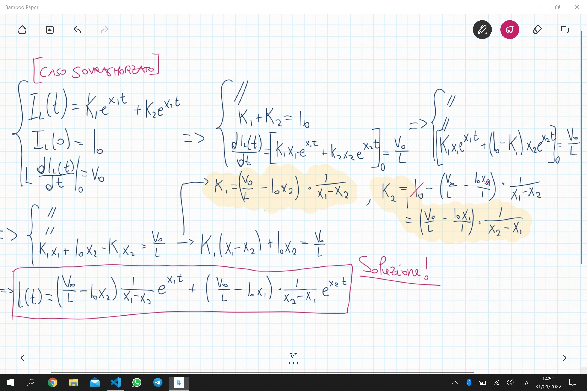

Fisica 2 - Lezione 9
====================

Il Circuito RLC:
----------------

Riprendendo dall'ultima lezione, in cui abbiamo trovato l'equazione differenziale di secondo grado ed abbiamo iniziato ad analizzarla:  

  

Da questa analisi riusciamo a trovare vari possibili scenari.  
Il nostro segnale può smorzarsi molto rapidamente, può oscillare nello smorzarsi oppure può smorzarsi con una gobba, causata da quel termine lineare al tempo nel caso $\Delta=0$.  
Proviamo quindi a studiare il primo caso:  

  

Questa è la soluzione generale dell'equazione che descrive la corrente all'interno dell'induttore di un circuito RLC parallelo nello specifico caso sovrasmorzato.  
Studiamo ora anche il caso sottosmorzato nello specifico:  

  

Troviamo quindi un'equazione per determinare quale sarà la fase iniziale della corrente nel caso di un'oscillazione dovuta ad un circuito di tipo sottosmorzato.  

Definiamo ora una nuova costante del circuito RLC, detta **Fattore Di Qualità**, o $Q$, che è lo smorzamento relativo dell'oscillazione, definito come:  
$$Q = \frac{\omega_{0}}{2\alpha} = \frac{RC}{\sqrt{LC}} = R\sqrt{\frac{C}{L}}$$  
Questa equazione chiaramente vale per i circuiti RLC in parallelo, nel caso apportassimo modifiche alla topologia della rete, cambierebbe anche la formula di $Q$.  
$Q$ è un valore indicativo che ci dice quanta energia c'è nel sistema rispetto a quanta ne viene dissipata.  
$$Q\space\alpha\space\frac{E_{sistema}}{E_{dissipata}}$$  
Proviamo ora a misurare il $Q$ nelle varie casistiche dell'equazione differenziale:  
$$\Delta > 0 : \alpha > \omega_{0} \Longrightarrow Q < \frac{1}{2}$$  
$$\Delta < 0 : Q > \frac{1}{2}, se \space\alpha \to \infty \Longrightarrow Q \to \infty$$  
$$\Delta = 0 : x_{\frac{1}{2}}=-\alpha=-\omega_{0}\Longrightarrow Q = \frac{1}{2}$$  
$$\alpha \to 0 : Re(x_{\frac{1}{2}}) = 0, Im(x_{\frac{1}{2}}) \ne 0 \Longrightarrow Q \to \infty$$  

Ciò che abbiamo determinato fin'ora è stata la **risposta ad ingresso zero** del circuito RLC parallelo. Proviamo ora a studiarne invece la **risposta a stato zero**, ossia ciò che accade nel momento in cui il circuito da spento viene alimentato in qualche modo.  

  
  

Vediamo quindi che nel caso sottosmorzato la corrente oscilla attorno al valore di corrente in ingresso, facendo rimbalzare energia tra induttore e condensatore, seguendo l'andamento di un coseno sfasato di $\theta$, e nel tempo si stabilizza, a causa del dumping dovuto ad $e^{-\alpha t}$.  

Nel caso sovrasmorzato invece, la corrente ha un andamento diverso, infatti la corrente non presenta termini oscillatori, invece si nota una chiara resistenza all'ingresso causata dall'induttore che nel tempo si annulla grazie ai termini $e^{x_{\frac{1}{2}}t}$ ricordandoci che $x_{\frac{1}{2}} < 0$, stabilizzando la corrente attorno al valore della corrente in ingresso.  
